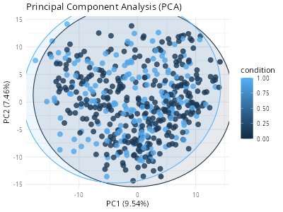
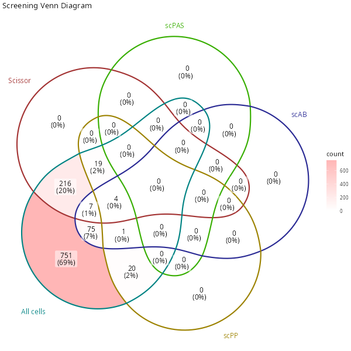
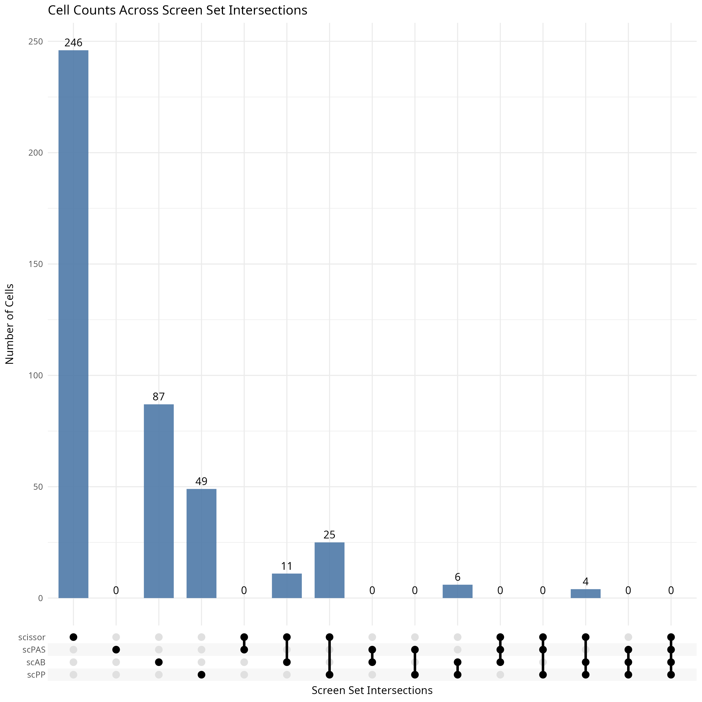
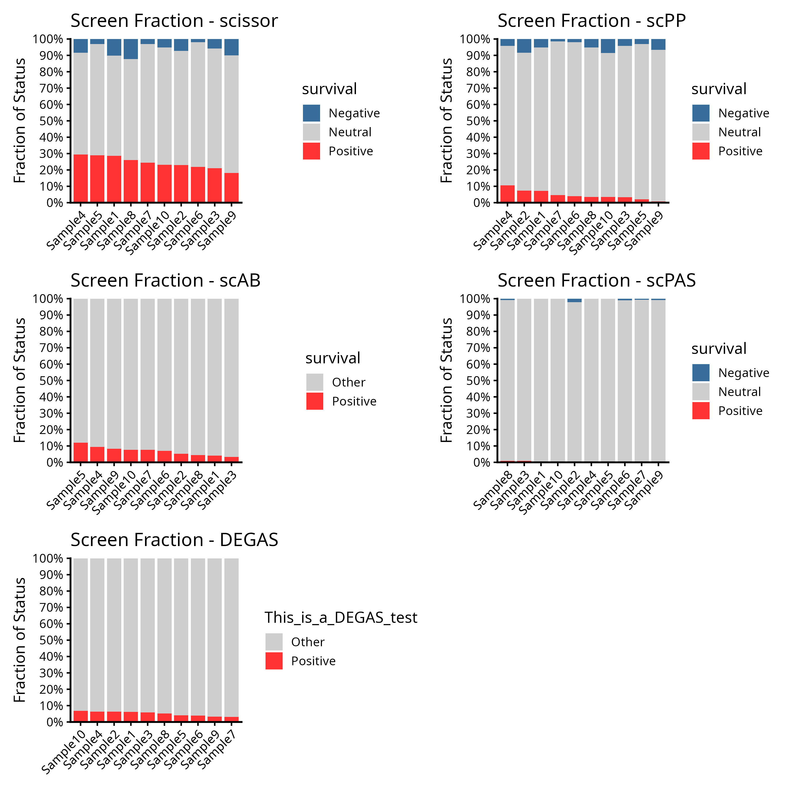
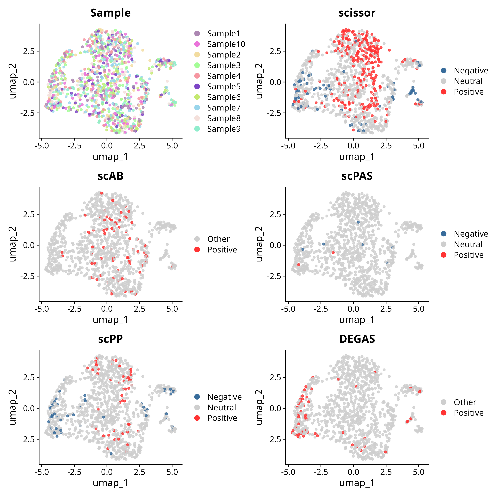

# Full Tutorial for SigBridgeR

## 0. Preface

### 0.1 Contents

-   [Full Tutorial for SigBridgeR](#full-tutorial-for-sigbridger)
    -   [0. Preface](#0-preface)
        -   [0.1 Contents](#01-contents)
        -   [0.1 Introduction to SigBridgeR](#01-introduction-to-sigbridger)
    -   [1. Installation](#1-installation)
        -   [1.1 Stable Release from GitHub](#11-stable-release-from-github)
        -   [1.2 Release from r-universe](#12-release-from-r-universe)
    -   [2. Load and Preprocess data](#2-load-and-preprocess-data)
        -   [2.1 Single-cell RNA-seq Data](#21-single-cell-rna-seq-data)
            -   [2.1.1 (Option A) Start from Raw Matrix](#211-option-a-start-from-raw-matrix)
            -   [2.1.2 (Option B) Start from AnnData Object](#212-option-b-start-from-anndata-object)
            -   [2.1.8 (Optional) Filter Out Tumor Cells](#218-optional-filter-out-tumor-cells)
        -   [2.2 Bulk expression data](#22-bulk-expression-data)
            -   [2.2.1 Evaluate the quality of your bulk RNA-seq data](#221-evaluate-the-quality-of-your-bulk-rna-seq-data)
                -   [Quality Control Metrics Reported](#quality-control-metrics-reported)
                -   [Recommended Parameter Adjustments](#recommended-parameter-adjustments)
            -   [2.2.2 Gene Symbol Conversion](#222-gene-symbol-conversion)
        -   [2.3 Phenotype Data](#23-phenotype-data)
    -   [3. Screen Cells Associated with Phenotype](#3-screen-cells-associated-with-phenotype)
        -   [3.1 (Option A) Scissor Screening](#31-option-a-scissor-screening)
        -   [3.2 (Option B) scPAS Screening](#32-option-b-scpas-screening)
        -   [3.3 (Option C) scAB Screening](#33-option-c-scab-screening)
        -   [3.4 (Option D) scPP Screening](#34-option-d-scpp-screening)
        -   [3.5 (Option E) DEGAS Screening](#35-option-e-degas-screening)
        -   [3.6 (Option F) LP_SGL Screening](#36-option-f-lp_sgl-screening)
        -   [3.7 (Option G) PIPET Screening](#37-option-g-pipet-screening)
        -   [3.8 Merge screening results](#38-merge-screening-results)
    -   [4. Visualization](#4-visualization)
        -   [4.1 UMAP for screening results](#41-umap-for-screening-results)
        -   [4.2 Stack bar plot for screening results](#42-stack-bar-plot-for-screening-results)
        -   [4.3 Venn diagram for screening results](#43-venn-diagram-for-screening-results)
        -   [4.4 Upset plot for screening results](#44-upset-plot-for-screening-results)
    -   [5. Example](#5-example)
        -   [5.1 Survival-associated cell screening](#51-survival-associated-cell-screening)
        -   [5.2 Continuous Phenotype-associated cell screening](#52-continuous-phenotype-associated-cell-screening)
        -   [5.3 Binarized phenotype-associated cell screening](#53-binarized-phenotype-associated-cell-screening)
    -   [6. Troubleshooting](#6-troubleshooting)
    -   [7. References](#7-references)

### 0.1 Introduction to SigBridgeR

SigBridgeR (short for **Sig**nificant cell-to-phenotype **Bridge** in **R**) is an R package for screening cells highly associated with phenotype data using single-cell RNA-seq, bulk RNA expression and sample related phenotype data (e.g. patient survival, age, etc). It integrates many single cell phenotypic screening methods ([8. References](#8-references)) and provides unified preprocessing, parameter tuning, and visualization approaches,performing as a unified integration panel.

------------------------------------------------------------------------

## 1. Installation

Install **SigBridgeR** using one of these methods:

### 1.1 Release from GitHub

Usually we recommend installing the latest release from GitHub because of the latest features and bug fixes.

```{r,install_from_github,eval=FALSE}
if(!requireNamespace("pak")) {
  install.packages("pak")
}
pak::pkg_install("WangLabCSU/SigBridgeR")
```

### 1.2 Release from r-universe

```{r,install_from_r_universe,eval=FALSE}
install.packages("SigBridgeR", repos = "https://wanglab.r-universe.dev")
```

If you encounter compatibility issues, you can install the version of the package indicated in  [7. Troubleshooting](#7-troubleshooting).

------------------------------------------------------------------------

## 2. Load and Preprocess data

First load the packages, you will see a version number message indicating successful loading:

```{r,load_package,eval=FALSE}
library(SigBridgeR)
# ✔ SigBridgeR v2.x.x loaded
```

### 2.1 Single-cell RNA-seq Data

You can use function `SCPreProcess` to preprocess your single-cell RNA-seq data. Here are some options:

#### 2.1.1 (Option A) Start from Raw Matrix

When starting from a raw count matrix (data.frame, matrix or dgCMatrix), `SCPreProcess` will automatically perform Seurat preprocess (including `NormalizeData, FindVariableFeatures, ScaleData, RunPCA, FindNeighbors, FindClusters, RunTSNE, RunUMAP`). `SCPreProcess` returns a fully preprocessed Seurat object for downstream use.

```{r,scpreprocessing_raw_matrix,eval=FALSE}
your_seurat <- SCPreProcess(
  your_matrix,
  # * Parameters used in Seurat preprocessing pipeline
  meta_data = NULL,
  project = "Screen_Single_Cell", 
  min_cells = 400,
  min_features = 0,
  normalization_method = "LogNormalize",
  scale_factor = 10000,
  scale_features = NULL,
  selection_method = "vst",
  resolution = 0.6,
  dims = 1:10,
  verbose = TRUE,
  # * Parameters used in SigBridgeR workflow
  quality_control = TRUE,
  # Filter mitochondrial genes, human for '^MT-', mouse for '^mt-', or specify your own pattern
  quality_control.pattern = c("^MT-"), 
  data_filter = TRUE,
  data_filter.thresh = list(
    nFeature_RNA_thresh = c(200L, 6000L),
    percent.mt = 20L, # mitochondrial genes
    # percent.rp = 60L # ribosomal protein genes

    # ? When filtering for non-mitochondrial genes and non-ribosomal proteins RNA genes,
    # ? the column names are in lowercase letter form with regular expression symbols removed.
    # `quality_control.pattern = "^[rt]rna"`
    # Correct threshhold setting is `percent.rt_rna = 60L`

    # ? Use `SigBridgeR:::Pattern2Colname()` to get the correct colname if still confused.
  ),
  column2only_tumor = NULL,
  ...
)
```

1.  **Build the initial Seurat object**

    -   Imports the count matrix.\
    -   Applies the first, coarse filters: genes must be detected in \>= `min_cells` cells; cells must contain \>= `min_features` genes.\
    -   Attaches optional sample metadata.

2.  **Mitochondrial QC (default: ON)**

    -   A single regular expression (`^MT-` or `^mt-`) is used to compute the percentage of mitochondrial reads per cell. Customized regexps are also supported.
    -   The metric is stored in `object$percent.mt` for later filtering.

3.  **Cell filtering (default: ON)**\
    Cells are retained only if they satisfy **all** of the following:

    -   `nFeature_RNA` lies between the lower and upper bounds defined by `data_filter.thresh$nFeature_RNA_thresh`.\
    -   `percent.mt` is below the user-defined cut-off (`data_filter.thresh$percent.mt`).

4.  **Normalisation, variable-feature selection and scaling**\
    Encapsulated in `ProcessSeuratObject()`:

    -   Counts are normalised with the chosen method (default: *LogNormalize*).\
    -   Highly variable features are identified using the requested algorithm (default: *vst*).\
    -   Expression values of those features are scaled to unit variance.

5.  **Dimensionality reduction and clustering**\
    `ClusterAndReduce()` runs:

    -   PCA -\> nearest-neighbour graph -\> Louvain clustering (resolution parameterised).\
    -   UMAP for two-dimensional visualization.\
    -   Optionally removes very small or low-quality clusters.

6.  **Tumour-cell flagging**\
    `FilterTumorCell()` use a binary label (Tumour, Normal) from the column specified by `column2only_tumor` and filters the Seurat object to contain only the cancer cells. 

#### 2.1.2 (Option B) Start from AnnData Object

`SCPreProcess` also supports AnnData objects, which is a popular format for storing single-cell data. You can use package `anndata` or `anndataR` to read in your AnnData object from `.h5ad` file. 

You may reference and use the following code to read in your file via `anndata`:

```{r,scpreprocessing_anndata,eval=FALSE}
reticulate::use_pythonenv("The_path_to_your_python") 
# reticulate::use_condaenv("conda_env_name")

anndata_obj <- anndata::read_h5ad("path_to_your_file.h5ad") # Or other file formats, make sure the matrix is in obj$X.
```

Or use `anndataR` to read in your file:

```{r,scpreprocessing_anndatar,eval=FALSE}
reticulate::use_pythonenv("The_path_to_your_python") 
# reticulate::use_condaenv("conda_env_name")

anndata_obj <- anndataR::read_h5ad("path_to_your_file.h5ad") # basically no difference 
```

Then just pass it to `SCPreProcess`:

```{r,scpreprocessing_in_anndata,eval=FALSE}
your_seurat <- SCPreProcess(
  anndata_obj,
  # * Parameters used in Seurat preprocessing pipeline
  meta_data = NULL, # auto-detect from anndata_obj$obs
  project = "Screen_Single_Cell",
  min_cells = 400,
  min_features = 0,
  normalization_method = "LogNormalize",
  scale_factor = 10000,
  scale_features = NULL,
  selection_method = "vst",
  resolution = 0.6,
  dims = NULL, # auto-detect from an elbow plot
  verbose = TRUE,
  # * Parameters used in SigBridgeR workflow
  quality_control = TRUE,
  # Filter mitochondrial genes and ribosomal protein genes,
  quality_control.pattern = c("^MT-", "^RP[SL]"),
  data_filter = TRUE,
  data_filter.thresh = list(
    nFeature_RNA_thresh = c(200L, 6000L),
    # Corresponding to `quality_control.pattern`
    percent.mt = 20L, # mitochondrial genes
    percent.rp = 60L # ribosomal protein genes
  ),
  column2only_tumor = "Tissue", # keep only cells from tumor tissues
  ...
)
```

The description of data (meta.data) in `anndata_obj$obs` will be add to `your_seurat@meta.data`.

**helpful documentation:**

For the structure of `anndata`, you can refer to

-   [AnnData for R](https://github.com/dynverse/anndata)
-   [{anndataR}: An R package for working with AnnData objects](https://github.com/scverse/anndataR)

#### 2.1.8 (Optional) Filter Out Tumor Cells

If you aim to filter out phenotype-associated cells in all tumor cells. With a preprocessed Seurat object (containing results from ), `SCPreProcess` will filter out tumor cells using the specified metadata column:

```{r,scpreprocessing_seurat,eval=FALSE}
your_seurat <- SCPreProcess(your_seurat, column2only_tumor = "Tissue")
```

> Note: I don't recommend using columns like `column2only_tumor = "Celltype"` as tumor cell identities vary across tissues. instead:
>
> -   Create a Dedicated Column: Add a new metadata column (e.g., is_tumor) to explicitly label cells:"Tumo(u)r"/"Normal"
>
> -   Code Example:
>
> ```{r,choose_tumor_column,eval=FALSE}
> # For glioblastoma (GBM)
> seurat_obj[[]]$is_tumor <- ifelse(
>  grepl("GBM|glioblastoma|astrocytoma_grade_IV", seurat_obj[[]]$Celltype, ignore.case = TRUE),
>  "Tumor",  # or "Tumour" 
>  "Normal"  # or "Non-Tumor" 
> )
> ```

### 2.2 Bulk expression data

Here are some methods for processing bulk RNA-seq gene expression data matrices.

#### 2.2.1 Evaluate the quality of your bulk RNA-seq data

`BulkPreProcess` performs comprehensive quality control on raw bulk RNA-seq count matrix data.

Key parameters for `BulkPreProcess`:

-   `data`: Expression matrix with genes as rows and samples as columns, or a list containing count_matrix and sample_info.
-   `sample_info`: Sample information data frame (optional), ignored if data is a list. A qualified `sample_info` should contain both `sample` and `condition` columns (case-sensitive), and there are no specific requirements for the data type stored in the `condition` column.
-   `gene_symbol_conversion`: Whether to convert Ensembl version IDs and TCGA version IDs to genes with [SymbolConvert in Section 2.2.2](#222-gene-symbol-conversion), default TRUE.
-   `check`: Whether to perform detailed quality checks, default TRUE.
-   `min_count_threshold`: Minimum count threshold for gene filtering, default 10.
-   `min_gene_expressed`: Minimum number of samples a gene must be expressed in, default 3.
-   `min_total_reads`: Minimum total reads per sample, default 1e6.
-   `min_genes_detected`: Minimum number of genes detected per sample, default 10000.
-   `min_correlation`: Minimum correlation threshold between samples, default 0.8.
-   `n_top_genes`: Number of top variable genes for PCA analysis, default 500.
-   `show_plot_results`: Whether to generate PCA visualization plots, default TRUE.
-   `verbose`: Whether to output detailed information, default TRUE.

Suppose you have bulk RNA-seq count data and sample information, and you want to perform comprehensive preprocessing and quality control. You can refer to and use the following code:

```{r,bulk_preprocess_example,eval=FALSE}
# Example usage of BulkPreProcess
filtered_counts <- BulkPreProcess(
   data = your_count_matrix,
   sample_info = your_sample_info,
   gene_symbol_conversion = TRUE,
   check = TRUE,
   min_count_threshold = 10,
   min_samples_expressed = 3,
   min_total_reads = 1e6,
   min_genes_detected = 10000,
   min_correlation = 0.8,
   n_top_genes = 500,
   show_plot_results = TRUE,
   verbose = TRUE
)
```

The function returns a filtered bulk count matrix after applying quality control steps and does not perform log2 transformation on the data.

##### Quality Control Metrics Reported 

-   Gene Filtering: 
    
    First, lowly expressed genes are removed, retaining genes that have an expression level reaching `min_count_threshold` in at least `min_gene_expressed` samples. This step is based on statistical power considerations, as lowly expressed genes are prone to false-positive results in differential analysis.

-   Sample Filtering: 
  
    Subsequently, low-quality samples are filtered based on three core indicators:\
    - Sequencing Depth: The total number of reads must reach `min_total_reads`.
    - Library Complexity: The number of detected genes must exceed `min_genes_detected`.
    - Sample Consistency: When quality checking is enabled, the average correlation between samples must meet the `min_correlation` threshold.

- Data Integrity Check: Identifies technical anomalies; too many missing values may indicate experimental issues.

- Feature Expression Filtering: Uses a count threshold rather than a proportion threshold to avoid over-penalizing small samples. Genes must be stably expressed in multiple samples to ensure the reliability of statistical tests.

- Sample-Level Filtering: 
  
  Comprehensively evaluates technical quality: \
  Sequencing depth ensures detection sensitivity, the number of detected genes reflects library diversity, and sample correlation (Pearson) validates experimental reproducibility. PCA analysis further identifies batch effects and outlier samples.

-   PCA Variance: 
    
    Variance explained by first two principal components. \
    When `show_plot_results = TRUE`, the function generates PCA plot colored by experimental condition

-   Batch Effects: Proportion of genes significantly affected by batch

##### Recommended Parameter Adjustments 

Parameter settings need to balance data quality and information retention:

-   For Low-Depth Sequencing Data: 
    
    Should relax `min_total_reads` and `min_genes_detected` due to technical limitations rather than quality issues causing low indicators.

-   For Noisy Datasets:  
    
    Need to increase the `min_correlation` threshold to strengthen sample consistency requirements and exclude technical variation interference.

-   For Large Datasets: 

    Consider setting `check = FALSE` to enable only partial filtering functions and speed up the process.

All parameters are set based on empirical values, and users should make appropriate adjustments according to the specific experimental design and sequencing platform characteristics.

#### 2.2.2 Gene Symbol Conversion

`SymbolConvert` performs a straightforward task: converting common gene identifiers (e.g., Ensemble IDs, Entrez) to standardized gene symbols by using the [IDConverter](https://github.com/ShixiangWang/IDConverter) package.

```{r,symbol_convert_example,eval=FALSE}
# genes * samples
your_bulk_data <- read.csv("path_to_your_file.csv", header = TRUE, row.names = 1)

your_bulk_data <- SymbolConvert(your_bulk_data)
```

You can also use other package like `org.Hs.eg.db`  for gene symbol matching if you prefer not to use SymbolConvert's built-in `IDConverter`.

```{r,symbol_convert_example2,eval=FALSE}
library(org.Hs.eg.db)

your_bulk_data <- read.csv("path_to_your_file.csv", header = TRUE, row.names = 1)

your_bulk_data <- BulkPreProcess(your_bulk_data, gene_symbol_conversion = FALSE)

ensembl_ids <- sub("\\..*", "", rownames(your_bulk_data))
gene_symbols <- mapIds(org.Hs.eg.db, 
                      keys = ensembl_ids,
                      column = "SYMBOL",
                      keytype = "ENSEMBL",
                      multiVals = "first")

rownames(your_bulk_data) <- gene_symbols
```

### 2.3 Phenotype Data

Bascially you can just use your phenotype data directly. If you are confused about the structure `Screen()` requires, please refer to [Section 5](#example).

You can use this function to check NA values, which tells you the location of NA values in your phenotype data:

```{r,NA_check_function,eval=FALSE}
# `max_print`: output how many NA location messages at one time if NA exists
CheckNA <- function(data, max_print = 5) {
    # Load required packages
    rlang::check_installed(c("dplyr", "purrr", "cli", "data.table"))

    # Convert to data.table if it's a 2D structure but not already a data.table
    is_2d <- !is.null(dim(data))
    dt <- NULL

    if (is_2d && !data.table::is.data.table(data)) {
        dt <- data.table::as.data.table(data)
    } else if (is_2d) {
        dt <- data
    }

    # Initialize output
    na_info <- list()

    cli::cli_h1("NA Value Check (data.table optimized)")
    cli::cli_alert_info("Checking object with dimensions: {.val {dim(data)}}")

    # Handle 1D data (vectors)
    if (!is_2d) {
        na_count <- sum(is.na(data))
        na_positions <- which(is.na(data))
        na_info$positions <- na_positions
        na_info$count <- na_count

        if (na_count == 0) {
            cli::cli_alert_success("No NA values found in the vector!")
        }

        cli::cli_alert_warning("Found {.val {na_count}} NA value{?s} in vector")

        if (length(na_positions) > 0 && max_print > 0) {
            positions_to_show <- na_positions[
                1:min(max_print, length(na_positions))
            ]
            cli::cli_text("Positions: {.val {positions_to_show}}")

            if (length(na_positions) > max_print) {
                cli::cli_text(
                    "{.val {length(na_positions) - max_print}} additional positions not shown"
                )
            }
        }

        # For named vectors
        if (!is.null(names(data))) {
            na_names <- names(data)[na_positions]
            na_info$names <- na_names

            if (length(na_names) > 0 && max_print > 0) {
                names_to_show <- na_names[1:min(max_print, length(na_names))]
                cli::cli_text("Names: {.val {names_to_show}}")
            }
        }
    } else {
        # Handle 2D data (dataframes, matrices, data.tables)
        # Use data.table for efficient NA counting
        na_count <- dt[, sum(is.na(.SD))]
        na_info$count <- na_count

        if (na_count == 0) {
            cli::cli_alert_success("No NA values found in the 2D data!")
        }

        cli::cli_alert_warning(
            "Found {.val {na_count}} NA value{?s} in 2D data"
        )

        # Get NA positions efficiently without melt warning
        if (max_print > 0) {
            # Create a matrix of logical values indicating NA positions
            na_matrix <- is.na(as.matrix(dt))
            na_positions <- which(na_matrix, arr.ind = TRUE)

            # Convert to data.table and add column names
            na_positions_dt <- data.table::as.data.table(na_positions)
            colnames(na_positions_dt) <- c("row", "col")
            na_positions_dt$col_name <- colnames(dt)[na_positions_dt$col]

            na_info$positions <- na_positions_dt

            if (nrow(na_positions_dt) > 0) {
                positions_to_show <- na_positions_dt[
                    1:min(max_print, nrow(na_positions_dt)),
                ]

                cli::cli_text(
                    "First {.val {nrow(positions_to_show)}} position{?s}:"
                )

                for (i in 1:nrow(positions_to_show)) {
                    cli::cli_text(
                        "  Row {.val {positions_to_show$row[i]}}, Col {.val {positions_to_show$col_name[i]}} (index: {.val {positions_to_show$col[i]}})"
                    )
                }

                if (na_count > max_print) {
                    cli::cli_text(
                        "{.val {na_count - max_print}} additional positions not shown"
                    )
                }
            }
        }

        # Column-wise summary using data.table
        col_na <- dt[, lapply(.SD, function(x) sum(is.na(x)))]
        col_na <- unlist(col_na)
        col_na <- col_na[col_na > 0]

        if (length(col_na) > 0) {
            na_info$column_na <- col_na

            cli::cli_text("Column-wise NA counts:")
            for (col in names(col_na)) {
                cli::cli_text("  {.field {col}}: {.val {col_na[col]}}")
            }
        }
    }

    return(invisible(na_info))
}
```

------------------------------------------------------------------------

## 3. Screen Cells Associated with Phenotype

The function **`Screen`** provide 5 different options for screening cells associated with phenotype, These 5 algorithms come from the repositories mentioned in [7. References](#7-references), and you can choose one of them to screen your cells.

Key parameters for `Screen`:

-   `matched_bulk`: A data frame of bulk expression data after intersecting samples. Make sure the rownames of `matched_bulk` is identical to `phenotype`.
-   `sc_data`: A Seurat object after preprocessing, you can use the output of `Preprocess` function or your own preprocessed Seurat object.
-   `phenotype`: A data frame or named vacor of phenotype data after intersecting samples. See [5. Example](#5-example) for more details.
-   `label_type`: A character value specifying the filtering labels are stored in the `Seurat_object@misc` . Default: `NULL`, meaning the name of metho will be used.
-   `phenotype_class`: A character value specifying the phenotype data type, i.e. `"binary"`, `"survival"` or `"continuous"`.
-   `screen_method`: A character value specifying the screening method, i.e. "Scissor", "scPAS", "scAB", "scPP",  "DEGAS", "LP_SGL", or "PIPET"
-   `...`: Other parameters for the screening methods, see below

### 3.1 (Option A) Scissor Screening

Parameters pass to `...` when using `Scissor` method:

-   `path2save_scissor_inputs`: A character value specifying the path to save intermediate data, you can also set `path2load_scissor_cache = NULL` to suppress the saving of intermediate files. Default: `Scissor_inputs.RData`
-   `path2load_scissor_cahce`: A character value specifying the path to load intermediate data
-   `alpha`: Parameter used to balance the effect of the l1 norm and the network-based penalties. It can be a number or a searching vector. If alpha = NULL, a default searching vector is used. The range of alpha is in `[0,1]`. A larger alpha lays more emphasis on the l1 norm.
-   `cutoff`: Cutoff for the percentage of the Scissor selected cells in total cells. This parameter is used to restrict the number of the Scissor selected cells. A cutoff less than 50% (default 20%) is recommended depending on the input data. Only used when `alpha = NULL`.
-   `reliability_test`: A logical value specifying whether to perform reliability test. Default: `FALSE`
-   `reliability_test.n`: Permutation times (default: 10)
-   `reliability_test.nfold`: The fold number in cross-validation (default: 10)
-   `cell_evaluation`: A logical value specifying whether to perform cell evaluation. Default: `FALSE`
-   `cell_evaluation.benchmark_data`: Path to benchmark data (RData file).
-   `cell_evaluation.FDR`: FDR threshold for cell evaluation (default: 0.05).
-   `cell_evaluation.bootstrap_n`: Number of bootstrap iterations for cell evaluation (default: 100).


**Usage**:

```{r,scissor_screening,eval=FALSE}
scissor_result = Screen(
  matched_bulk = matched_bulk,
  sc_data = sc_dataset, # A Seurat object after preprocessing
  phenotype = matched_phenotype_data,
  label_type = "TP53", # The filtering labels are stored in the `@misc`, you can change it to your own label
  phenotype_class = "binary",  
  screen_method = c("Scissor"),
  path2save_scissor_inputs = "Tmp/Scissor_inputs.RData" # Intermediate data
)
```

You can use the intermediate data for repeated runs. This is an inherent feature of the `Scissor`.

```{r,scissor_screening_cache,eval=FALSE}
scissor_result = Screen(
  sc_data = sc_dataset, 
  label_type = "TP53", 
  phenotype_class = "binary", 
  screen_method = c("Scissor"),
  path2load_scissor_cahe = "Tmp/Scissor_inputs.RData" # Intermediate data
)
```

If only the parameters `alpha` and `cutoff` are adjusted, this method can also be applied.

```{r,scissor_screening_param_adjusted,eval=FALSE}
# When `alpha = NULL`, an alpha iteration will continue until phenotype-associated cells are screened out or no cells are screened out even after exceeding the `cutoff`.
scissor_result = Screen(
  sc_data = sc_dataset, 
  label_type = "TP53", 
  phenotype_class = "binary", 
  screen_method = c("Scissor"),
  path2load_scissor_cahce = "Tmp/Scissor_inputs.RData", # Intermediate data
  alpha = NULL, 
  cutoff = 0.2
)

```

**Returning structure**: A list containing:

-   `scRNA_data`: A Seurat object after screening
-   `scissor_result`: The result of Scissor screening, including the parameters used
-   `reliability_test`: Reliability test results
-   `cell_evaluation`: Cell evaluation results

**Cell level Evaluation & Reliability Test**:

You can use `cell_evalutaion = TRUE` and `reliability_test = TRUE` to obtain some supporting information for each Scissor selected cell. First, prepare a benchmark dataset yourself for cell evalutaion.

```{r,scissor_screening_cell_level_evaluation,eval=FALSE}
scissor_result = Screen(
  sc_data = sc_dataset, 
  label_type = "TP53", 
  phenotype_class = "binary", 
  screen_method = c("Scissor"),
  path2load_scissor_cahce = "Tmp/Scissor_inputs.RData", # Intermediate data
  reliability_test = TRUE,
  cell_evaluation = TRUE,
  cell_evaluation.benchmark_data = "path_to_benchmark_data.RData",
  alpha = NULL, 
  cutoff = 0.05 
)
```

helpful documentation:

[Scissor-Cell Level Evaluations](https://sunduanchen.github.io/Scissor/vignettes/Scissor_Tutorial.html#cell-level-evaluations)

### 3.2 (Option B) scPAS Screening

Parameters pass to `...` when using `scPAS` method (basically adapted from the `scPAS`'s documentation):

-   Parameters passed to `scPAS::scPAS()`

    These parameters directly interface with the core `scPAS`() function from the original package:

    -   `assay`: Name of Assay to get.
    -   `imputation`: Logical. imputation or not.
    -   `imputation_method`: Character. Name of alternative method for imputation.
    -   `nfeature`: Numeric. The Number of features to select as top variable features in `sc_data`. Top variable features will be used to intersect with the features of `matched_bulk`. Default is NULL and all features will be used.
    -   `alpha`: Numeric. Parameter used to balance the effect of the l1 norm and the network-based penalties. It can be a number or a searching vector. If `alpha = NULL`, a default searching vector is used. The range of alpha is in `[0,1]`. A larger alpha lays more emphasis on the l1 norm.
    -   `cutoff`: Numeric. Cutoff for the percentage of the scPAS selected cells in total cells when `alpha = NULL`. This parameter is used to restrict the number of the scPAS selected cells. A cutoff less than 50% (default 20%) is recommended depending on the input data.
    -   `network_class`: The source of feature-feature similarity network. By default this is set to sc and the other one is bulk.
    -    `FDR_threshold`: Numeric. FDR value threshold for identifying phenotype-associated cells (default: 0.05)
    -    `independent`: Logical. The background distribution of risk scores is constructed independently of each cell. (default: TRUE)
    -    `permutation_times`: Number of permutations to perform (default: 2000)

**usage**:

```{r,scPAS_screening,eval=FALSE}
scpas_result = Screen(
  matched_bulk = matched_bulk,
  sc_data = A_Seurat_object,
  phenotype = phenotype,
  label_type = "TP53", # The filtering labels are stored in the `@misc`
  screen_method = "scPAS",
  phenotype_class = "binary",
  assay = 'RNA',
  imputation = FALSE,
  imputation_method = c("KNN", "ALRA"),
  nfeature = 3000L,
  alpha = c(0.01, NULL),
  cutoff = 0.2,
  network_class = c("SC", "bulk"),
  permutation_times = 2000L,
  FDR_threshold = 0.05,
  independent = TRUE
)
```

**returning structure**: A list containing:

-   `scRNA_data`: A Seurat object after screening
-   `stats`: A data.frame the significance of scPAS screening results
-   `para`: A list containing the parameters used in scPAS screening

### 3.3 (Option C) scAB Screening

Parameters pass to `...` when using `scAB` method (basically adapted from the `scAB`'s documentation):

-   `alpha`: Coefficient of phenotype regularization, default is `0.005`. When specified `NULL`, a default searching vector is used. A custom numeric vector is also supported.
-   `alpha_2`: Coefficient of cell-cell similarity regularization, default is `0.005`. When specified `NULL`, a default searching vector is used. A custom numeric vector is also supported
-   `maxiter`: Maximum number of iterations, default is `2000`
-   `tred`: Threshold for early stopping, default is `2`

**usage**:

```{r,scAB_screening,eval=FALSE}
scab_result = Screen(
  matched_bulk = your_matched_bulk,
  sc_data = A_Seurat_object,
  phenotype = your_matched_phenotype,
  label_type = "TP53", # The filtering labels are stored in the `@misc`
  screen_method = "scAB",
  phenotype_class = "binary",
  alpha = c(0.005, NULL),
  alpha_2 = c(0.005, NULL),
  maxiter = 2000L,
  tred = 2L
)
```

**note**:

When both `alpha` and `alpha_2` are specified as `NULL` or as search vectors, the total number of searches equals the product of their lengths, which may lead to long runtimes. In such cases, we recommend enabling parallel computation.

```{r,scAB_screening_parallel,eval=FALSE}
setFuncOption(parallel = TRUE, parallel.type = 'multisession', workers = 4L)
```

Then simply run the function directly.

**returning structure**: A list containing:

-   `scRNA_data`: A Seurat object after screening
-   `scAB_result`: A list with the submatrix and loss value

### 3.4 (Option D) scPP Screening

Parameters pass to `...` when using `scPP` method :

-   `ref_group`: The reference group for the binary analysis, default is `0`
-   `Log2FC_cutoff`: The cutoff for the log2 fold change of the binary analysis, default is `0.585`
-   `estimate_cutoff`: Effect size threshold for continuous traits, default is `0.2`
-   `probs`: Quantile cutoff in (0, 0.5) for cell classification, default is `0.2`. When specified `NULL`, a default searching vector is used. A custom searching vector is also supported.

**usage**:

```{r,scPP_screening,eval=FALSE}
# This will take several hours
scpp_result = Screen(
  matched_bulk = your_matched_bulk,
  sc_data = A_Seurat_object,
  phenotype = your_matched_phenotype,
  label_type = "TP53", # The filtering labels are stored in the `@misc` 
  screen_method = "scpp",
  phenotype_class = "binary",
  ref_group = 0,
  Log2FC_cutoff = 0.585,
  estimate_cutoff = 0.2,
  probs = c(0.2, NULL)
)
```

**returning structure**: A list containing:

-   `scRNA_data`: A Seurat object after screening
-   `gene_list`: A list containing positive genes and negative genes

### 3.5 (Option E) DEGAS Screening

Parameters pass to `...` when using `DEGAS` method 

- `sc_data.pheno_colname`: The column name of the phenotype in the `sc_data@meta.data` slot, used to specify the phenotype for more accurate screening. Default is `NULL`.
- `tmp_dir`: The directory for storing the intermediate files. Default is `NULL`, a directory named `tmp` will be created.
- `env_params` : A list of parameters for the environment, default is `list()`. Use `?DoDEGAS` to see the details.
- `degas_params`: A list of parameters for the DEGAS algorithm, default is `list()`. Use `?DoDEGAS` to see the details.
- `normality_test_method`: Method for normality testing: `"jarque-bera", "d'agostino", or "kolmogorov-smirnov"`, default is "jarque-bera".

```{r,DEGAS_screening,eval=FALSE}
degas_result = Screen(
  matched_bulk = your_matched_bulk,
  sc_data = A_Seurat_object,
  phenotype = your_matched_phenotype,
  label_type = "TP53", # The labels are stored in the `@misc` and are used to identify the screening results.
  screen_method = "DEGAS",
  # The type of phenotype
  phenotype_class = c("binary", "continuous", "survival"),
  # Environment parameters
  env_params = list(
    env.name = "r-reticulate-degas",
    env.type = "conda",
    # Environment.yml file will be used to create the conda environment in default, so other parameters can be omitted
    env.method = "environment",
    # The path of the environment.yml file
    env.file = system.file(
      "conda/DEGAS_environment.yml",
      package = "SigBridgeR"
    ),
    env.python_verion = "3.9.15",
    env.packages = c(
      "tensorflow" = "2.4.1",
      "protobuf" = "3.20.3"
    ),
    # Force re-creating the env
    env.recreate = FALSE,
    # Use conda-forge channel for env creating
    env.use_conda_forge = TRUE,
    # Message output when creating the env 
    env.verbose = FALSE
  ),
  # DEGAS parameters
  degas_params = list(
    # DEGAS.model_type will be automatically determined by the `phenotype_class`
    DEGAS.model_type = c(
      "BlankClass", # only bulk level phenotype specified
      "ClassBlank", # only single cell level phenotype specified
      "ClassClass", # when both single cell level phenotype and bulk level phenotype specified
      "ClassCox", # when both single cell level phenotype and bulk level survival data specified
      "BlankCox" # only bulk level survival data specified
    ),
    # DEGAS.architecture will be `DenseNet` in default
    DEGAS.architecture = c(
      "DenseNet", # a dense net network
      "Standard" # a feed forward network
    ),
    # The path to save intermediate data
    path.data = '',
    path.result = '',
    # The python executable path of the conda environment, auto detected in default
    DEGAS.pyloc = NULL,
    # Some functions will be called in the DEGAS algorithm
    DEGAS.toolsPath = paste0(.libPaths()[1], "/DEGAS/tools/"), # or `file.path(.libaPaths()[1], "SigBridgeR/DEGAS_tools/")`
    # Screening parameters
    DEGAS.ff_depth = 3,
    DEGAS.bag_depth = 5,
    DEGAS.train_steps = 2000,
    DEGAS.scbatch_sz = 200,
    DEGAS.patbatch_sz = 50,
    DEGAS.hidden_feats = 50,
    DEGAS.do_prc = 0.5,
    DEGAS.lambda1 = 3.0,
    DEGAS.lambda2 = 3.0,
    DEGAS.lambda3 = 3.0,
    DEGAS.seed = 2
  ),
  # default: "jarque-bera".
  normality_test_method = c(
    "jarque-bera",
    "d'agostino",
    "kolmogorov-smirnov"
  )
)
```

This code chunk will CREATE a conda environment called "**r-reticulate-degas**" with python 3.9.15, and install the required packages (tensorflow, protobuf) for DEGAS. If an environment with the same name already exists, it will directly use this environment without creating a new one (unless specified `env_params = list(env.recreate=TRUE)`).

You can use `ListPyEnvs()` to list all the python environments in your system, including virtual environments. Both Windows and Unix-like systems are supported. More information can be found in [https://wanglabcsu.github.io/SigBridgeR/articles/Other_Function_Details.html](https://wanglabcsu.github.io/SigBridgeR/articles/Other_Function_Details.html)

```{r,show_python_envs,eval=FALSE}
# * On Unix-like system it goes like this
ListPyEnv()
#                 name                                                   python  type
# 1               base                         /home/user/miniconda3/bin/python conda
# 2 r-reticulate-degas /home/user/miniconda3/envs/r-reticulate-degas/bin/python conda
# 3               test                  /home/user/.virtualenvs/test/bin/python  venv
```

Please note that the environmental dependencies required for DEGAS to run are quite stringent, and conflicts are highly likely to occur. 

**returning structure**: A list containing:

-   `scRNA_data`: A Seurat object after screening
-   `model`: A model trained using single-cell RNA expression matrix, tissue bulk RNA sequencing expression matrix, and phenotypic data.
-   `DEGAS_prediction`: Using the model to conduct prediction for each cell, resulting in a data.frame where each phenotype has a predicted probability score.

### 3.6 (Option F) LP_SGL Screening

Parameters pass to `...` when using `LP_SGL` method 

- `resolution`: Resolution parameter for Leiden clustering (default: `0.6`)
-  `alpha`: Alpha parameter for SGL balancing L1 and L2 penalties (default: `0.5`)
- `nfold`: Number of folds for cross-validation (default: `5`)
- `dge_analysis`: List controlling differential expression analysis:
  - `run`: Whether to run DEG analysis (default: `FALSE`)
  - `logFC_threshold`: Log fold change threshold (default: `1`)
  - `pval_threshold`: P-value threshold (default: `0.05`)

```{r,LP_SGL_screening,eval=FALSE}
lpsgl_result <- Screen(
  matched_bulk = your_matched_bulk,
  sc_data = A_Seurat_object,
  phenotype = your_matched_phenotype,
  label_type = "TP53",
  resolution = 0.6,
  alpha = 0.5,
  nfold = 5,
  dge_analysis = list(
    run = FALSE, # whether to run DEG analysis
    logFC_threshold = 1,
    pval_threshold = 0.05
  ),
  ... # Additional parameters like verbose, seed
)
```

**returning structure**: A list containing:

- `scRNA_data`: A Seurat object after screening
- `sgl_fit` : Fitted SGL model object
- `cvfit` : Cross-validation results
- `dge_res` : Differential expression results if requested (NULL otherwise)

### 3.7 (Option G) PIPET Screening

Parameters pass to `...` when using `PIPET` method 

- **Phenotype adaptation parameters**:
  - `discretize_method`: Character: "kmeans"/"quantile"/"custom" (default: "kmeans")
  - `cutoff`: Numeric vector for custom discretization when `discretize_method` is "custom" (default: NULL)

- **Marker generation parameters**:
  - `log2FC`: Numeric: log2FC threshold (default: 1)
  - `p.adjust`: Numeric: adjusted p-value threshold (default: 0.05)

- **Single-cell annotation parameters**:
  - `distance`: Character: "cosine"/"pearson"/"spearman" (default: "cosine")
  - `nPerm`: Integer: permutation times for statistical test (default: 1000L)

**Usage**:

```{R,PIPET_screening,eval=FALSE}
pipet_result = Screen(
    matched_bulk = matched_bulk,
    sc_data = sc_dataset, # A Seurat object after preprocessing
    phenotype = matched_phenotype_data,
    label_type = "TP53", # The filtering labels are stored in the `Seurat_object@misc`
    phenotype_class = "binary", # `survival` is not supported 
    screen_method = "PIPET",
    # PIPET specific parameters
    lg2FC = 1,
    p.adjust = 0.05,
    distance = "cosine",
    nPerm = 1000,
    parallel = FALSE # Whether to use parallel computing, before using this parameter, please make sure that future::plan() has been called
)
```

**Returning structure**: A list containing:

- `scRNA_data`: A Seurat object after screening (with PIPET annotations in meta.data)
- `markers`: Phenotype-specific marker genes

### 3.8 Merge screening results

If you have performed multiple screening methods one the same single-cell data, you can use the `MergeResult` to merge the screening results of these methods. The Seurat object or a results list from `Screen` is accepted.

```{r,merge_screening_results,eval=FALSE}
merged_seurat = MergeResult(
    your_scissor_result, 
    your_scPAS_result, 
    your_scAB_result, 
    your_scPP_result,
    your_DEGAS_result
    # # * Add more if you want
    # ,your_LP_SGL_result,
    # your_PIPET_result
)

# * mixed input form is alse supported 

merged_seurat = MergeResult(
    your_scissor_result$scRNA_data, 
    your_scPAS_result$scRNA_data, 
    your_scAB_result, 
    your_scPP_result,
    your_DEGAS_result
    # # * Add more if you want
    # ,your_LP_SGL_result$scRNA_data,
    # your_PIPET_result
)

```

This function merges all slots from the input Seurat objects. Note that intermediate data (e.g., `scissor_result$reliability.test` or `scab_result$scAB_result`) will not be retained during the merge. While the function can technically combine different single-cell datasets, it is specifically designed for merging replicates or batches of the *same* single-cell RNA-seq experiment; using it for heterogeneous data may lead to subtle (and potentially hard-to-detect) errors.

**returning structure**:

A Seurat object with all merged slots.

------------------------------------------------------------------------

## 4. Visualization

Here we provide some visualization methods for the screening results. Considering that many people have different needs for data visualization, `SigBridgeR` hardly provides visualization (except for fraction plot and upset plot, because we provide some statistic results for them). We only provide the source code for reference.

### 4.1 UMAP for screening results

**example**:

Suppose you have performed all algorithm screening on your Seurat object and wish to examine the distribution across different celltypes and patient, you may reference and use the following code:

```{r,umap_exmaple,eval=FALSE}
library(zeallot)
# library(Seurat)
# library(patchwork)
# library(purrr)

c(
    celltype_umap,
    patient_umap,
    scissor_umap,
    scab_umap,
    scpas_umap,
    scpp_umap,
    degas_umap,
    # * Add more if you want
) %<-%
    purrr::map(
        # make sure these column names exist
        c("celltype", "patient", "scissor", "scAB", "scPAS", "scPP", "DEGAS"), 
        ~ Seurat::DimPlot(
            your_seurat_obj,
            group.by = .x,
            pt.size = 0.05,
            reduction = "umap"
        ) +
            ggplot2::ggtitle(.x)
    )

# * Show
umaps = celltype_umap +
    patient_umap +
    scissor_umap +
    scab_umap +
    scpas_umap +
    scpp_umap +
    degas_umap +
    # * Add more if you want
    patchwork::plot_layout(ncol = 3)

umaps
```

This will generate seven UMAP plots separately.

Or suppose you have performed `scPAS` screening on your Seurat object and want to visualize the distribution of prediction confidence scores, you may reference and use the following code:

```{r,umap_exmaple2,eval=FALSE}
library(zeallot)
library(patchwork)
# library(Seurat)
# library(purrr)

c(scPAS_Pvalue_umap, scPAS_NRS_umap) %<-%
    purrr::map(
        c("scPAS_Pvalue", "scPAS_NRS"),
        ~ Seurat::FeaturePlot(
            object = your_seurat_obj,
            features = .x,
        ) +
            ggplot2::ggtitle(.x) +
            theme(legend.position = "right")
    )

# * Show
scPAS_Pvalue_umap | scPAS_NRS_umap
```

This will generate two plots, one for each feature specified in `feature`.

**helpful documentation**:

[Seurat::DimPlot - https://satijalab.org/seurat/reference/DimPlot.html](https://satijalab.org/seurat/reference/DimPlot.html)

[Seurat::FeaturePlot - https://satijalab.org/seurat/reference/FeaturePlot.html](https://satijalab.org/seurat/reference/FeaturePlot.html)

### 4.2 Stack bar plot for screening results

Key parameters for `ScreenFractionPlot`:

-   `seurat_obj`: A Seurat object after screening.
-   `group_by`: Used to specify the column of the meta.data in `seurat_obj`. The plot results will be grouped by this parameter.
-   `screen_type`: Screening algorithm used before. (case-sensitive, e.g., "scissor" for Scissor results)
-   `show_null`: Logical, whether to show groups with zero cells (default: FALSE).
-   `plot_color` Custom color palette (named vector format):
    -   Required names: "Positive", "Negative", "Neutral", "Other"
    -   Default: c("Neutral"="#CECECE", "Other"="#CECECE", "Positive"="#ff3333", "Negative"="#386c9b")

Suppose you have already performed the `scPAS` algorithm screening on your Seurat object, and you want to check the proportion of positive cells across different patients. You can refer to and use the following code:

```{r,stack_bar_plot_example,eval=FALSE}
plot <- ScreenFractionPlot(
   screened_seurat = scpas_result$scRNA_data, 
   group_by = "patient", # grouping basis for the x-axis
   screen_type = "scPAS",
   plot_title = "scPAS Screening Results"
)
```

If you have performed multiple screening methods and already merged the results, you can use the following code:

```{r,stack_bar_plot_example_multiple,eval=FALSE}
plot <- ScreenFractionPlot(
   screened_seurat = merged_seurat, 
   group_by = "patient", # grouping basis for the x-axis
   screen_type = c("scPAS", "scAB", "scPP"), # multiple screening results
   plot_title = "Screening Results" #  A screen_type prefix will be added to the current plot title
)
```

The order of the groups is determined by the proportion of **Positive** cells within each group.

**returning structure**:

If a single screen_type is specified

-   `stats`: A data frame containing the proportion of positive cells for each group.
-   `plot`: A ggplot2 object.

If multiple screen_types are specified

-   `stats`: A list containing data frames containing the proportion of positive cells for each group.
-   `plot`: A list containing each ggplot2 objects.
-   `combined_plot`: A ggplot2 object containing all the plots (2\*2 grid).

### 4.3 Venn diagram for screening results

`ggVennDiagram` is used to generate a Venn diagram for the screening results. Suppose you have performed some of the screening algorithms on your Seurat object, and you want to check the overlap of the cells selected by each algorithm. You can refer to and use the following code:

**example**:

```{r,venn_diagram_example,eval=FALSE}
library(ggVennDiagram)

# # * If you have merged the results, you can use the following code instead:
# c(scissor_pos, scab_pos, scpas_pos, scpp_pos, degas_pos) %<-%
#     purrr::map(
#         c("scissor", "scAB", "scPAS", "scPP", "DEGAS"),
#         ~ colnames(merged_seurat)[
#             which(merged_seurat[[.x]] == "Positive")
#         ]
#     )

# * get the cell vectors
scissor_pos <- colnames(scissor_result$scRNA_data)[
    which(scissor_result$scRNA_data$scissor == "Positive")
]
scab_pos <- colnames(scab_result$scRNA_data)[
    which(scab_result$scRNA_data$scAB == "Positive")
]
scpas_pos <- colnames(scpas_result$scRNA_data)[
    which(scpas_result$scRNA_data$scPAS == "Positive")
]
scpp_pos <- colnames(scissor_result$scRNA_data)[
    which(scpp_result$scRNA_data$scPP == "Positive")
]
degas_pos <- colnames(degas_result$scRNA_data)[
    which(degas_result$scRNA_data$DEGAS == "Positive")
]


all_cells <- colnames(your_seurat_obj) 

# * create a list of cell vectors
pos_venn = list(
    scissor = scissor_pos,
    scpas = scpas_pos,
    scab = scab_pos,
    scpp = scpp_pos,
    degas = degas_pos,
    all_cells = all_cells
    # * you can add more groups here
)

set.seed(123)

venn_plot = ggVennDiagram::ggVennDiagram(
    x = pos_venn,
    # * the labels of each group to be shown on the diagram
    category.names = c(
        "Scissor",
        "scPAS",
        "scAB",
        "scPP",
        "DEGAS",
        "All cells"
    ),
    # * the colors of each group
    set_color = c(
        "#a33333ff",
        "#37ae00ff", 
        "#2a2a94ff",
        "#9c8200ff",
        "#bb14adff",
        "#008383ff"
    )
) +
    ggplot2::scale_fill_gradient(low = "white", high = "#ffb6b6ff") +
    ggplot2::ggtitle("Screening Venn Diagram")
```

**helpful link**:

[ggVennDiagram - https://gaospecial.github.io/ggVennDiagram/](https://gaospecial.github.io/ggVennDiagram/)

### 4.4 Upset plot for screening results

If too many screening meyhods are selected, the number of intersections among cells screened by different methods will also increase. In this case, using an upset plot is more intuitive and neat than a Venn diagram.

`ggupset` is used for visualizing upset plot.

Key parameters for `ScreenUpset`:

- `screened_seurat`: A Seurat object after screening.
- `screen_type`: Screening algorithm used before. (case-sensitive, e.g., "scissor" for Scissor results)
- `n_intersections` : Number of intersections to display in the plot. Default: 20.
-   `x_lab` : Label for the x-axis. Default: "Screen Set Intersections".
-   `y_lab` : Label for the y-axis. Default: "Number of Cells".
-   `title` : Plot title. Default: "Cell Counts Across Screen Set Intersections".
-   `bar_color` : Color for the bars in the plot. Default: "#4E79A7".
-   `combmatrix_point_color` : Color for points in the combination matrix. Default: "black".
-   `...` : Additional arguments passed to `ggplot2::theme()` for customizing the plot appearance.

```{r,upset_plot_example,eval=FALSE}
upset <- ScreenUpset(screened_seurat = merged_seurat)
```

**returning structure**:

-   `plot`: A ggplot2 object.
-   `stats`: A data frame containing the numbers of positive cells for each group.

**helpful link**:

[ggupset - https://github.com/const-ae/ggupset](https://github.com/const-ae/ggupset)

------------------------------------------------------------------------

## 5. Example 

### 5.1 Survival-associated cell screening

Here we use the example data LUAD to demonstrate how to use the functions in `SigBridgeR` to screen cells associated with phenotype.

```{r,set_working_directory,eval=FALSE}
# Set working directory
if (requireNamespace("here", quietly = TRUE)) {
  here::i_am(".here")
  setwd(here::here())         
  knitr::opts_knit$set(root.dir = here::here())  
}
```

```{r,example_data,eval=FALSE}
library(SigBridgeR)
library(zeallot)

# * load the example data
c(mat_exam, bulk, pheno) %<-% LoadRefData(data_type = "survival")

dim(mat_exam)
 #[1] 33694  1093
dim(bulk) 
# [1] 4071  506
bulk[1:6,1:6]
#         TCGA-69-7978 TCGA-62-8399 TCGA-78-7539 TCGA-73-4658 TCGA-44-6775 TCGA-44-2655
# HIF3A         4.2598      11.6239       9.1362       5.0288       4.0573       5.5335
# RTN4RL2       8.2023       5.5819       3.5365       7.4156       7.7107       5.3257
# HMGCLL1       2.7476       5.8513       3.8334       3.6447       2.9188       4.8820
# LRRTM1        0.0000       0.4628       4.7506       6.8005       7.7819       2.2882
# GRIN1         6.6074       5.4257       4.9563       7.3510       3.5361       3.3311
# LRRTM3        1.7458       2.0092       0.0000       1.4468       0.0000       0.0000
nrow(pheno)
# [1] 506
head(pheno)
#               time status
# TCGA-69-7978  4.40      0
# TCGA-62-8399 88.57      0
# TCGA-78-7539 25.99      0
# TCGA-73-4658 52.56      1
# TCGA-44-6775 23.16      0
# TCGA-44-2655 43.50      0
```

This single-cell RNA data is from humans. We set many parameters to `FALSE` or `0` in order to maximize the flexibility of downstream analyses and capture a broader range of biological signals, so as to avoid insignificant results caused by too small a dataset.

In practical data analysis, please adjust the thresholds and parameters as needed for your specific use case.

Now we use `SCPreProcess()` to pre-process the single-cell RNA expression matrix data.

```{r,example_data_seurat,eval=FALSE}
seurat = SCPreProcess(
  sc = mat_exam,
  quality_control = FALSE,
  data_filter = FALSE,
  min_cells = 0,
  min_features = 0,
  scale_features = rownames(mat_exam),
  dims = 1:20,
  resolution = 0.1
)
```

`BulkPreProcess()` is to pre-process the bulk expression data and the related clinical data.frame (containing bulk sample information) to perform PCA. Here, we want to retain the data so that the screening can reflect the most accurate situation. You can choose whether to filter or retain based on your own needs. See also [2.2 Bulk expression data](#22-bulk-expression-data) for more details.

To facilitate the demonstration of the use of the `sample_info` parameter, we will divide the `pheno` based on its survival status into two groups, which will be stored in the `condition` column. `batch` column is used to store the batch information of the samples. The example is from one single batch. 

In practice, please replace this with your actual phenotype classification; the approach shown here is for demonstration purposes only and is not recommended for real analyses.

```{r,example_data_bulk,eval=FALSE}
sample_info <- tibble::rownames_to_column(pheno, var = "sample") %>%
  dplyr::rename(condition = status)
sample_info$batch <- 'batch1'

head(sample_info)
#         sample  time condition  batch
# 1 TCGA-69-7978  4.40         0 batch1   
# 2 TCGA-62-8399 88.57         0 batch1
# 3 TCGA-78-7539 25.99         0 batch1
# 4 TCGA-73-4658 52.56         1 batch1
# 5 TCGA-44-6775 23.16         0 batch1
# 6 TCGA-44-2655 43.50         0 batch1

set.seed(123)

# * generate a mock data
gene_ids <- c(
  paste0("ENSG", sprintf("%011d", 1:3900)),
  paste0("GENE_", LETTERS[1:100])
)
library(MASS)
mu <- c(
  runif(500, 100, 2000), # high
  runif(1500, 20, 200), # medium
  rexp(2000, rate = 1 / 2) # low (gamma-like, many near-zero)
)
lib_size_factor <- rlnorm(506, meanlog = log(3e7), sdlog = 0.3) / 3e7 # ~20–60M reads
counts_mat <- matrix(0L, nrow = 4000, ncol = 506)

for (i in seq_len(4000)) {
  mu_i <- mu[i] * lib_size_factor
  # dispersion decreases with mean: phi ≈ 0.5 / sqrt(mu_i + 1)
  phi_i <- pmax(0.05, 0.5 / sqrt(mu_i + 1))
  size_i <- 1 / phi_i
  counts_mat[i, ] <- rnbinom(506, mu = mu_i, size = size_i)
}
counts_mat <- floor(counts_mat)
counts_mat[counts_mat < 0] <- 0L

colnames(counts_mat) <- sample_info$sample
rownames(counts_mat) <- gene_ids


filtered_counts_mat <- BulkPreProcess(
  data = counts_mat,
  sample_info = sample_info,
  min_count_threshold = 10L,
  min_gene_expressed = 3L,
  min_total_reads = 1e5L,
  min_genes_detected = 1000L,
  min_correlation = 0.8,
  n_top_genes = 500L, # used in pca
  show_plot_results = TRUE
)
# ✔ [2025/12/23 15:19:20] Data loaded: 4000 genes * 506 samples
# ℹ Aggregate Duplicated genes in rownames
# ℹ [2025/12/23 15:19:21] Starting detailed quality checks...
# ✔ Sample correlation: Good (minimum = 0.95)
# ℹ [2025/12/23 15:19:23] PCA completed: PC1(0.99%) PC2(0.83%), 27 outlier samples
# Warning: Detected 27 outlier sample(s) : TCGA-86-A456, TCGA-55-A492, TCGA-78-8660, TCGA-69-7973, TCGA-69-7980, TCGA-97-7937, TCGA-55-6543, TCGA-86-8671, TCGA-86-8359, TCGA-05-4405, TCGA-62-A471,
# TCGA-35-3615, TCGA-05-5428, TCGA-99-8025, TCGA-44-6779, TCGA-4B-A93V, TCGA-MP-A4T7, TCGA-55-8203, …, TCGA-55-8301, and TCGA-55-7727
# ℹ [2025/12/23 15:19:23] Generating visualization plots...
# ✔ [2025/12/23 15:19:24] Data filtering completed:
# ℹ   Genes: 4000 -> 2703 (removed 1297)
# ℹ   Samples: 506 -> 506 (removed 0)
# ✔ [2025/12/23 15:19:24] BulkPreProcess completed
```

And we will see a PCA plot.

```{r,bulk_preprocess_pca_plot,eval=FALSE}
knitr::include_graphics("vignettes/example_figures/bulk_preprocess_pca.png")
```

[{fig-align="center" width="600"}]((https://github.com/WangLabCSU/SigBridgeR/blob/main/vignettes/example_figures/bulk_preprocess_pca.png))


Thus far, we have completed all the data preprocessing. We are now ready to formally employ various single-cell phenotypic screening algorithms.

First, we use `scissor` to screen cells associated with survival.

```{r,example_data_scissor,eval=FALSE}
scissor_result <- Screen(
    matched_bulk = bulk,
    sc_data = seurat,
    phenotype = pheno,
    label_type = "survival",
    phenotype_class = "survival",
    screen_method = "Scissor",
    alpha = 0.05
)

# ℹ [2025/09/08 17:03:20] Scissor start...
# ℹ [2025/09/08 17:03:20] Start from raw data...
# ℹ Using "RNA_snn" graph for network.
# ℹ [2025/09/08 17:03:20] Normalizing quantiles of data...
# ℹ [2025/09/08 17:03:20] Subsetting data...
# ℹ [2025/09/08 17:03:21] Calculating correlation...
# ----------------------------------------------------------------------------------------------------
# Five-number summary of correlations:

#         0%        25%        50%        75%       100% 
# -0.2342323  0.0594385  0.1118708  0.1642065  0.5250605 
# ----------------------------------------------------------------------------------------------------
# ℹ [2025/09/08 17:03:21] Perform cox regression on the given clinical outcomes:
# ✔ Statistics data saved to `Scissor_inputs.RData`.
# ℹ [2025/09/08 17:03:22] Screening...
#
# ── At alpha = 0.05 ──
#
# Scissor identified 265 Scissor+ cells and 73 Scissor- cells.
# The percentage of selected cell is: 30.924%

table(scissor_result$scRNA_data$scissor)
# Negative  Neutral Positive 
#       73      755      265 

```

You will see an additional "Scissor_inputs.RData" in the working directory. This is the intermediate data generated by the Scissor method, which we can use to save running time ( You can also set `path2load_scissor_cache=NULL` to suppress the saving of intermediate files ). Meanwhile, we set `reliability_test=TRUE`, which will run an additional reliability test.

```{r,example_data_scissor_reliability,eval=FALSE}
scissor_result <- Screen(
    matched_bulk = bulk, # doesn't need to be provided Since the intermediate data is provided
    sc_data = seurat,
    phenotype = pheno_ok, # doesn't need to be provided Since the intermediate data is provided
    label_type = "survival",
    phenotype_class = "survival",
    screen_method = "Scissor",
    alpha = 0.05,
    path2load_scissor_cache = "Scissor_inputs.RData",
    reliability_test = TRUE
)
# ℹ [2025/09/08 16:07:48] Scissor start...
# ℹ [2025/09/08 16:07:48] Loading data from `Scissor_inputs.RData`...
# ℹ [2025/09/08 16:07:48] Screening...
# [1] "alpha = 0.05"
# [1] "Scissor identified 249 Scissor+ cells and 245 Scissor- cells."
# [1] "The percentage of selected cell is: 45.197%"

# --------------------------------------------------------------------------------
# ℹ [2025/09/08 16:07:54] Start reliability test

# Attaching package: ‘survival’

# The following object is masked from ‘package:future’:

#     cluster

# [1] "|**************************************************|"
# [1] "Perform cross-validation on X with true label"
# Finished!
# [1] "|**************************************************|"
# [1] "Perform cross-validation on X with permutated label"
# Finished!
# [1] "Test statistic = 0.590"
# [1] "Reliability significance test p = 0.000"
# ✔ [2025/09/08 16:10:54] reliability test: Done

scissor_result$reliability_result$statistic
# [1] 0.5899587

scissor_result$reliability_result$p
# [1] 0

scissor_result$reliability_result$c_index_test_real
#  [1] 0.6038544 0.5022222 0.6050725 0.6279391 0.5064935 0.6033520 0.6769231 0.6453089 0.4968421 0.6315789

scissor_result$reliability_result$c_index_test_back %>% unlist() %>% matrix(nrow = 10)
#            [,1]      [,2]      [,3]      [,4]      [,5]      [,6]      [,7]      [,8]      [,9]     [,10]
#  [1,] 0.5594714 0.4943820 0.5379747 0.5583658 0.5527728 0.6146435 0.5130597 0.5701275 0.4691943 0.5177305
#  [2,] 0.5735608 0.4726891 0.4146341 0.5020661 0.5354331 0.6840149 0.5540275 0.4990758 0.5324484 0.5497382
#  [3,] 0.5960145 0.5157116 0.6191446 0.5091912 0.5659656 0.5870370 0.5090580 0.4247788 0.5734266 0.5539715
#  [4,] 0.6210191 0.6563147 0.5581948 0.4675615 0.4688222 0.5308219 0.5100402 0.6709091 0.6155779 0.5607143
#  [5,] 0.4623656 0.5716695 0.4920441 0.5403727 0.5555556 0.5911215 0.5738499 0.6189258 0.5871560 0.6084337
#  [6,] 0.5868794 0.5127660 0.7416880 0.5366876 0.5417440 0.5633803 0.5161943 0.4830372 0.4732965 0.5740132
#  [7,] 0.4975610 0.5751503 0.4801902 0.5588972 0.4940898 0.5723370 0.5788382 0.6171875 0.5884413 0.5445545
#  [8,] 0.6331361 0.5970516 0.5473888 0.6274131 0.5159705 0.5000000 0.5299760 0.4905660 0.5277778 0.5027322
#  [9,] 0.6390805 0.6548913 0.5049310 0.6299639 0.6385135 0.5964392 0.5381605 0.7462687 0.5185185 0.6585859
# [10,] 0.5207373 0.5000000 0.6051780 0.4932127 0.6892430 0.4786517 0.5619266 0.6614583 0.6502242 0.5333333
```

Next, we use scPAS, scAB, scPP, LP_SGL and PIPET to do the same screening. Generally you only need to change the `screen_method`, as long as you have not specified any particular parameters.

```{r,example_data_scpas,eval=FALSE}
scpas_result <- Screen(
    matched_bulk = bulk,
    sc_data = seurat,
    phenotype = pheno,
    label_type = "survival",
    phenotype_class = "survival",
    screen_method = "scPAS",
    alpha = 0.05
)
# ℹ [2025/10/20 16:24:27] Start scPAS screening.
# ℹ [2025/10/20 16:24:29] Quantile normalization of bulk data.
# ℹ [2025/10/20 16:24:29] Extracting single-cell expression profiles...
# ℹ [2025/10/20 16:24:29] Constructing a gene-gene similarity by single cell data...
# Building SNN based on a provided distance matrix
# Computing SNN
# ℹ [2025/10/20 16:24:30] Optimizing the network-regularized sparse regression model...
# ℹ [2025/10/20 16:24:30] Perform cox regression on the given phenotypes...
# 
# ── At alpha = 0.05 ──
# 
# lambda = 0.776168989003421
# scPAS identified 59 risk+ features and 61 risk- features.
# The percentage of selected feature is: 13.73%
# ℹ [2025/10/20 16:24:49] Calculating quantified risk scores...
# ℹ [2025/10/20 16:24:49] Qualitative identification by permutation test program with 2000 times random perturbations...
# ✔ [2025/10/20 16:24:50] scPAS screening done.

table(scpas_result$scRNA_data$scPAS)

# Negative  Neutral Positive 
#       5     1085        3 
```

As you can see, due to differences in data and algorithms, not every screening algorithm is able to screen out cells. You can adjust the corresponding parameters, e.g. change the `alpha` to `NULL`, this will make scPAS iterate alpha until the result is significant (or judged as having no significant cell subpopulations). See also [3.2 (Option B) scPAS Screening](#32-option-b-scpas-screening)

```{r,example_data_scpas2,eval=FALSE}
scpas_result <- Screen(
    matched_bulk = bulk,
    sc_data = seurat,
    phenotype = pheno,
    label_type = "survival",
    phenotype_class = "survival",
    screen_method = "scPAS",
    alpha = NULL,
    cutoff = 0.2 
)
# ℹ [2025/10/20 16:43:31] Start scPAS screening.
# ℹ [2025/10/20 16:43:32] Quantile normalization of bulk data.
# ℹ [2025/10/20 16:43:32] Extracting single-cell expression profiles...
# ℹ [2025/10/20 16:43:32] Constructing a gene-gene similarity by single cell data...
# Building SNN based on a provided distance matrix
# Computing SNN
# ℹ [2025/10/20 16:43:33] Optimizing the network-regularized sparse regression model...
# ℹ [2025/10/20 16:43:33] Perform cox regression on the given phenotypes...
# 
# ── At alpha = 0.001 ──
# 
# lambda = 7.61825638357188
# scPAS identified 315 risk+ features and 366 risk- features.
# The percentage of selected feature is: 77.918%
# 
# ── At alpha = 0.005 ──
# 
# lambda = 3.68743152046651
# scPAS identified 193 risk+ features and 231 risk- features.
# The percentage of selected feature is: 48.513%
# 
# ── At alpha = 0.01 ──
# 
# lambda = 2.55333682907113
# scPAS identified 137 risk+ features and 158 risk- features.
# The percentage of selected feature is: 33.753%
# 
# ── At alpha = 0.05 ──
# 
# lambda = 0.776168989003421
# scPAS identified 59 risk+ features and 61 risk- features.
# The percentage of selected feature is: 13.73%
# ℹ [2025/10/20 16:44:55] Calculating quantified risk scores...
# ℹ [2025/10/20 16:44:55] Qualitative identification by permutation test program with 2000 times random perturbations...
# ✔ [2025/10/20 16:44:57] scPAS screening done.
```

Generally speaking, a larger alpha means looser screening. However, it still won't result in the occurence of too many false-positive cells. You can also adjust the `cutoff` parameter as you like.

```{r,example_data_scpas3,eval=FALSE}
table(scpas_result$scRNA_data$scPAS)
# Negative  Neutral Positive 
#        5     1085        3 
```

Now we use scAB, scPP, DEGAS, LP_SGL and PIPET to screen cells.

```{r,example_data_scab,eval=FALSE}
scab_result = Screen(
    matched_bulk = bulk,
    sc_data = seurat,
    phenotype = pheno,
    label_type = "survival",
    phenotype_class = "survival",
    screen_method = "scAB"
)
# ℹ [2025/09/08 17:04:51] Start scAB screening.
# ℹ  Using "RNA_snn" graph for network.
# ℹ [2025/09/08 17:04:52] Selecting K...
# ℹ [2025/09/08 17:06:15] Run NMF with phenotype and cell-cell similarity regularization at K = 3.
# ℹ [2025/09/08 17:06:19] Screening cells...
# ℹ [2025/09/08 17:06:19] scAB screening done.

table(scab_result$scRNA_data$scAB)
#    Other Positive 
#     1018       75 
```

```{r,example_data_scpp,eval=FALSE}
scpp_result = Screen(
    matched_bulk = bulk,
    sc_data = seurat,
    phenotype = pheno,
    label_type = "survival",
    phenotype_class = "survival",
    screen_method = "scPP"
)
# ℹ [2025/09/08 17:00:28] Start scPP screening.
# ℹ [2025/09/08 17:00:28] Finding markers...
# Warning in coxph.fit(X, Y, istrat, offset, init, control, weights = weights,  :
#   Loglik converged before variable  1 ; coefficient may be infinite. 
# ℹ [2025/09/08 17:00:52] Screening...
# Genes in the gene sets NOT available in the dataset: 
# 	gene_pos: 	13 (6% of 230)
# 	gene_neg: 	54 (12% of 446)
# There are no genes significantly upregulated in Phenotype- compared to Phenotype+.
# ✔ [2025/09/08 17:00:54] scPP screening done.

table(scpp_result$scRNA_data$scPP)
# Negative  Neutral Positive 
#       52      993       48 
```

```{r,example_data_degas,eval=FALSE}
# I recommend running this code in the background.
degas_result = Screen(
    matched_bulk = bulk,
    sc_data = seurat,
    phenotype = pheno,
    label_type = "This_is_a_DEGAS_test",
    phenotype_class = "survival",
    screen_method = "DEGAS"
)
# ℹ [2025/10/09 18:41:00] Starting DEGAS Screen
# ℹ [2025/10/09 18:41:01] Setting up Environment...
# ℹ [2025/10/09 18:41:08] Training DEGAS model...
# ℹ [2025/10/09 18:41:08] 3-layer DenseNet BlankCox DEGAS model
# ℹ [2025/10/09 18:41:10] Python check passed, using Python 3.9.15
# ℹ [2025/10/09 18:41:10] Training...
###########################
# Many output from python #
###########################
# ℹ [2025/10/10 17:35:04] Predicting and Labeling...
# ℹ [2025/10/10 17:35:04] Labeling screened cells...
# ℹ [2025/10/10 17:35:04] Searching for survival-associated cells...
# ℹ Scores over 0.499 are considered `Positive`.
# ℹ [2025/10/10 17:35:04] DEGAS Screen done.

table(degas_result$scRNA_data$DEGAS)
#    Other Positive 
#     1038       55 
```

```{r,example_data_lpsgl,eval=FALSE}
# I recommend running this code in the background.
lpsgl_result <- Screen(
    matched_bulk = bulk,
    sc_data = seurat,
    phenotype = pheno,
    label_type = "LP_SGL",
    phenotype_class = "survival",
    screen_method = "LP_SGL"  
)
# ℹ [2025/11/22 21:14:29] Starting LP-SGL screening analysis
# ℹ [2025/11/22 21:14:29] Fetch graph from Seurat object
# ℹ [2025/11/22 21:14:29] Run Leiden clustering
# ℹ [2025/11/22 21:14:30] Calculating correlation matrix...
# ℹ [2025/11/22 21:14:33] Fitting SGL model with alpha = 0.5, this may take a while
# ℹ [2025/11/22 21:14:49] Running 5-fold cross-validation
# ℹ [2025/11/22 21:17:31] Optimal lambda index: 20 (error = 1380.7537932881)
# ℹ [2025/11/22 21:17:31] LP-SGL screening completed

table(lpsgl_result$scRNA_data$LP_SGL)
# Negative  Neutral Positive 
#       77      778      233 
```

Note that PIPET does not support survival phenotype. We will show how to use PIPET in [Section 5.3](#53-binarized-phenotype-associated-cell-screening)

After these algorithms have been run, the four sets of data can be merged since screening methods performed on the same data.

```{r,example_data_merge,eval=FALSE}
screen_result = MergeResult(
    scissor_result,
    scpas_result,
    scab_result,
    scpp_result,
    degas_result,
    lpsgl_result
)
# ✔ Successfully merged 6 objects.

class(screen_result)
# [1] "Seurat"
# attr(,"package")
# [1] "SeuratObject"

colnames(screen_result[[]])
#  [1] "orig.ident"      "nCount_RNA"      "nFeature_RNA"    "test_col"        "percent.rp"      "percent.mt"      "RNA_snn_res.0.1" "seurat_clusters"
#  [9] "scissor"         "scAB"            "scAB_Subset1"    "Subset1_loading" "scAB_Subset2"    "Subset2_loading" "scPAS_RS"        "scPAS_NRS"      
# [17] "scPAS_Pvalue"    "scPAS_FDR"       "scPAS"           "scPP_AUCup"      "scPP_AUCdown"    "scPP"            "DEGAS"           "LP_SGL"                 

```

Finally, we can visualize the screening results. Let's start with a Venn diagram to see the situation.

```{r,example_data_venn,eval=FALSE}
library(ggVennDiagram)
library(zeallot)

# * color palette
set.seed(123)
my_colors <- randomcoloR::distinctColorPalette(
  length(unique(screen_result$seurat_clusters)),
  runTsne = TRUE
)

c(scissor_pos, scab_pos, scpas_pos, scpp_pos, degas_pos, lpsgl_pos) %<-%
  purrr::map(
    c("scissor", "scAB", "scPAS", "scPP", "DEGAS", "LP_SGL"),
    ~ colnames(screen_result)[
      which(screen_result[[.x]] == "Positive")
    ]
  )

all_cells <- colnames(screen_result)

# * create a list of cell vectors
pos_venn <- list(
  scissor = scissor_pos,
  scpas = scpas_pos,
  scab = scab_pos,
  scpp = scpp_pos,
  degas = degas_pos,
  lp_sgl = lpsgl_pos,
  all_cells = all_cells
)


venn <- ggVennDiagram::ggVennDiagram(
  x = pos_venn,
  # * the labels of each group to be shown on the diagram
  category.names = c(
    "Scissor",
    "scPAS",
    "scAB",
    "scPP",
    "DEGAS",
    "LP_SGL",
    "All cells"
  ),
  # * the colors of each group
  set_color = c(
    "#a33333ff",
    "#37ae00ff",
    "#0000f5ff",
    "#d4b100ff",
    "#e600eeff",
    "#59108aff",
    "#008383ff"
  ),
  label_geom = "text"
) +
  ggplot2::scale_fill_gradient(low = "white", high = "#ffb6b6ff") +
  ggplot2::ggtitle("Screening Venn Diagram")

venn

# ggplot2::ggsave(
#   "vignettes/example_figures/venn.png",
#   plot = venn,
#   width = 10,
#   height = 10
# )
```

```{r,example_data_venn_plot,eval=FALSE}
knitr::include_graphics("vignettes/example_figures/venn.png")
```

[{fig-align="center" width="600"}]((https://github.com/WangLabCSU/SigBridgeR/blob/main/vignettes/example_figures/venn.png))

When there are too many sets, the visualization effect of the Venn diagram is not very good. We can use a set plot instead. Only positive cells are shown in the set plot.

```{r,example_data_set_plot,eval=FALSE}
upset <- ScreenUpset(
  screened_seurat = screen_result,
  screen_type = c("scissor", "scPAS", "scAB", "scPP", "DEGAS","LP_SGL"),
  n_intersections = 40
)

# * show the cell numbers of each set
head(upset$stats)
# # A tibble: 6 × 3
#   intersection    sets         count
#   <chr>           <named list> <dbl>
# 1 scissor         <chr [1]>      265
# 2 scPAS           <chr [1]>        2
# 3 scAB            <chr [1]>       75
# 4 scPP            <chr [1]>       49
# 5 DEGAS           <chr [1]>       55
# 6 LP_SGL          <chr [1]>      233

# ggplot2::ggsave(
#   "vignettes/example_figures/upset.png",
#   plot = upset$plot,
#   width = 10,
#   height = 10
# )
```

```{r,example_data_upset_plot,eval=FALSE}
knitr::include_graphics("vignettes/example_figures/upset.png")
```

[{fig-align="center" width="600"}]((https://github.com/WangLabCSU/SigBridgeR/blob/main/vignettes/example_figures/upset.png))


A bar chart showing proportions can also be used to examine the screening results. Since the example data does not have sample metadata, we have created a fictional `Sample` column.

```{r,example_data_bar,eval=FALSE}
set.seed(123)
# * fictional sample column
screen_result$Sample <- sample(
  paste0("Sample", 1:10),
  ncol(screen_result),
  replace = TRUE
)

table(screen_result$Sample)
#  Sample1 Sample10  Sample2  Sample3  Sample4  Sample5  Sample6  Sample7  Sample8  Sample9
#       98      117       96      119       95      100      101      131      115      121

fraction_list = ScreenFractionPlot(
  screened_seurat = screen_result,
  group_by = "Sample",
  screen_type = c("scissor", "scPP", "scAB", "scPAS", "DEGAS", "LP_SGL"),
  show_null = FALSE,
  plot_color = NULL,
  show_plot = TRUE
)
# Creating plots for 6 screen types...

# ggplot2::ggsave(
#   "vignettes/example_figures/fraction.png",
#   plot = fraction_list$combined_plot,
#   width = 10,
#   height = 10
# )
```

```{r,example_data_fraction_plot,eval=FALSE}
knitr::include_graphics("vignettes/example_figures/fraction.png")
```

As you see, the `label_type`s set in function `Screen` are shown in the legend of each plot. 

[{fig-align="center" width="600"}]((https://github.com/WangLabCSU/SigBridgeR/blob/main/vignettes/example_figures/fraction.png))

The `fraction_list` contains the statistical data and charts for each screening algorithm. The title of each plot will be appended with the method name as an identifier.


fraction_list

    ├── stats

    │   ├── scissor

    │   ├── scAB

    │   ├── scPAS

    │   ├── scPP   

    │   ├── DEGAS

    │   └── LP_SGL

    ├── plots

    │   ├── scissor

    │   ├── scAB

    │   ├── scPAS

    │   ├── scPP

    │   ├── DEGAS

    │   └── LP_SGL

    └── combined_plot # show 6 plots in one plot


UMAP is the most commonly used type of plot in academic literature.

```{r,example_data_umap,eval=FALSE}
library(patchwork)
library(zeallot)

my_palette <- randomcoloR::distinctColorPalette(
  k = length(unique(screen_result$Sample)),
  runTsne = TRUE
)

sample_umap <- Seurat::DimPlot(
  screen_result,
  group.by = "Sample",
  pt.size = 1.2,
  alpha = 0.8,
  reduction = "umap",
  cols = my_palette
) +
  ggplot2::ggtitle("Sample")


c(
  scissor_umap,
  scab_umap,
  scpas_umap,
  scpp_umap,
  degas_umap,
  lpsgl_umap
) %<-%
  purrr::map(
    c("scissor", "scAB", "scPAS", "scPP", "DEGAS", "LP_SGL"), # make sure these column names exist
    ~ Seurat::DimPlot(
      screen_result,
      group.by = .x,
      pt.size = 1.2,
      alpha = 0.8,
      reduction = "umap",
      cols = c(
        "Neutral" = "#CECECE",
        "Other" = "#CECECE",
        "Positive" = "#ff3333",
        "Negative" = "#386c9b"
      )
    ) +
      ggplot2::ggtitle(.x)
  )

# * Show
umaps <- sample_umap +
  scissor_umap +
  scab_umap +
  scpas_umap +
  scpp_umap +
  degas_umap +
  lpsgl_umap +
  patchwork::plot_layout(ncol = 2)

umaps

# ggplot2::ggsave(
#      "vignettes/example_figures/umaps.png",
#      plot = umaps,
#      width = 10,
#      height = 10
# )
```

```{r,example_data_umap_plot,eval=FALSE}
knitr::include_graphics("vignettes/example_figures/umaps.png")
```

[{fig-align="center" width="600"}]((https://github.com/WangLabCSU/SigBridgeR/blob/main/vignettes/example_figures/umaps.png))

All the analysis has been completed, and we can save the data for future use.

```{r,save_example_data,eval=FALSE}
SeuratObject::SaveSeuratRds(object = screen_result, filename = "screened_result.rds")
```

### 5.2 Continuous phenotype associated cell screening

Generally speaking, the process is the same as described in [5.1 Survival-associated cell screening](#51-survival-associated-cell-screening). Here, only the preprocessing of continuous phenotypic data is introduced.

```{r,example_data_continuous_preprocessing,eval=FALSE}
library(SigBridgeR)
library(zeallot)
library(Seurat)
setwd(here::here())

# * load the example data
c(mat_exam, bulk, pheno) %<-% LoadRefData(data_type = "continuous")

dim(mat_exam)
 #[1] 33694  1093
dim(bulk) 
# [1] 4106  289
bulk[1:6,1:6]
#        TCGA-AZ-6599-01 TCGA-AA-3655-01 TCGA-A6-6137-01 TCGA-CK-4952-01 TCGA-A6-5657-01 TCGA-AD-6963-01
# HIF3A           2.3437          2.0858          6.0759          1.9506          5.4777          4.4634
# CAMK4           4.9331          2.3709          4.1387          1.1557          4.1746          3.2363
# RNF112          2.4817          2.4947          3.5941          2.3486          4.9185          1.4621
# SPN             5.6704          6.8577          8.0598          5.0049          7.6076          7.3960
# LRRTM1          1.6031          0.9465          1.9142          0.0000          3.2523          0.0000
# GRIN1           6.4944          4.3225          2.8073          7.3460          4.5000          3.1816

# * A named vector
head(pheno)
# TCGA-AZ-6599-01 TCGA-AA-3655-01 TCGA-A6-6137-01 TCGA-CK-4952-01 TCGA-A6-5657-01 TCGA-AD-6963-01 
#             178              65              91             206              63              67 
```

If your phenotype is a `data.frame`, try this to convert it to a `named vector`:

```{r,example_data_continuous_preprocessing_2,eval=FALSE}
pheno <- setNames(your_data.frame$continuous_numeric, your_data.frame$sample)
```

### 5.3 Binarized phenotype associated cell screening

This process is also the same as described in [5.1 Survival-associated cell screening](#51-survival-associated-cell-screening). Here, only the preprocessing of binary phenotypic data is introduced.

```{r,example_data_binarized_preprocessing,eval=FALSE}
library(SigBridgeR)
library(zeallot)
library(Seurat)
setwd(here::here())

# * load the example data
c(mat_exam, bulk, pheno) %<-% LoadRefData(data_type = "binary")

dim(mat_exam)
 #[1] 33694  1093
dim(bulk) 
# [1] 4106  434
bulk[1:6,1:6]
#        TCGA-CA-5256-01 TCGA-AZ-6599-01 TCGA-AA-3655-01 TCGA-A6-6137-01 TCGA-CK-4952-01 TCGA-A6-5657-01
# HIF3A           3.7172          2.3437          2.0858          6.0759          1.9506          5.4777
# CAMK4           3.0698          4.9331          2.3709          4.1387          1.1557          4.1746
# RNF112          1.3702          2.4817          2.4947          3.5941          2.3486          4.9185
# SPN             5.5207          5.6704          6.8577          8.0598          5.0049          7.6076
# LRRTM1          3.2408          1.6031          0.9465          1.9142          0.0000          3.2523
# GRIN1           3.0698          6.4944          4.3225          2.8073          7.3460          4.5000

# * A named vector
head(pheno)
# TCGA-CA-5256-01 TCGA-AZ-6599-01 TCGA-AA-3655-01 TCGA-A6-6137-01 TCGA-CK-4952-01 TCGA-A6-5657-01 
#               1               1               1               1               1               1 

```

If your phenotype is a `data.frame`, your binary variable is stored in the "data" column, categorized as 'Tumor' and 'Normal', we will assign 'Tumor' a value of 1 and 'Normal' a value of 0. In this way, cells screened as **Positive** will be associated with 'Tumor'. Try this to convert it to a `named vector`:

```{r,example_data_binarized_preprocessing_2,eval=FALSE}
pheno = mutate(
    pheno,
    data = dplyr::case_when(
        data == "Tumor" ~ 1,
        data == "Normal" ~ 0
    )
)
pheno = setNames(pheno$data, pheno$Sample)
```

**A PIPET use case**

Previously, it was noted that PIPET cannot use patient survival data as the phenotype; here, we demonstrate using a binary phenotype instead.

```{r,example_data_pipet,eval=FALSE}

```

------------------------------------------------------------------------

## 6. Troubleshooting

View Troubleshooting[(https://github.com/WangX-Lab/SigBridgeR/wiki/Troubleshooting)](https://wanglabcsu.github.io/SigBridgeR/articles/Troubleshooting.html) for troubleshooting, especially for the environment setup.


Session information:

```{r,session_info}
sessionInfo()
# R version 4.4.1 (2024-06-14)
# Platform: x86_64-pc-linux-gnu
# Running under: Ubuntu 24.04.3 LTS

# Matrix products: default
# BLAS:   /usr/lib/x86_64-linux-gnu/openblas-pthread/libblas.so.3 
# LAPACK: /usr/lib/x86_64-linux-gnu/openblas-pthread/libopenblasp-r0.3.26.so;  LAPACK version 3.12.0

# locale:
#  [1] LC_CTYPE=en_US.UTF-8       LC_NUMERIC=C               LC_TIME=zh_CN.UTF-8        LC_COLLATE=en_US.UTF-8     LC_MONETARY=zh_CN.UTF-8   
#  [6] LC_MESSAGES=en_US.UTF-8    LC_PAPER=zh_CN.UTF-8       LC_NAME=C                  LC_ADDRESS=C               LC_TELEPHONE=C            
# [11] LC_MEASUREMENT=zh_CN.UTF-8 LC_IDENTIFICATION=C       

# time zone: Asia/Shanghai
# tzcode source: system (glibc)

# attached base packages:
# [1] stats     graphics  grDevices utils     datasets  methods   base     

# other attached packages:
# [1] magrittr_2.0.4 dplyr_1.1.4   

# loaded via a namespace (and not attached):
#   [1] RColorBrewer_1.1-3     sys_3.4.3              jsonlite_2.0.0         spatstat.utils_3.2-0   farver_2.1.2           Scissor_2.0.0         
#   [7] vctrs_0.6.5            ROCR_1.0-11            spatstat.explore_3.5-3 memoise_2.0.1          RCurl_1.98-1.17        askpass_1.2.1         
#  [13] htmltools_0.5.8.1      BiocBaseUtils_1.6.0    curl_7.0.0             sctransform_0.4.2      parallelly_1.45.1      KernSmooth_2.23-24    
#  [19] htmlwidgets_1.6.4      ica_1.0-3              plyr_1.8.9             httr2_1.0.4            plotly_4.11.0          zoo_1.8-14            
#  [25] cachem_1.1.0           igraph_2.2.0           mime_0.13              lifecycle_1.0.4        pkgconfig_2.0.3        Matrix_1.7-4          
#  [31] R6_2.6.1               fastmap_1.2.0          BiocCheck_1.40.0       fitdistrplus_1.2-4     future_1.67.0          shiny_1.11.1          
#  [37] digest_0.6.37          patchwork_1.3.2        ps_1.8.0               tensor_1.5.1           Seurat_5.3.0           RSpectra_0.16-2       
#  [43] irlba_2.3.5.1          RSQLite_2.4.3          filelock_1.0.3         progressr_0.16.0       spatstat.sparse_3.1-0  polyclip_1.10-7       
#  [49] abind_1.4-8            httr_1.4.7             compiler_4.4.1         bit64_4.6.0-1          withr_3.0.2            S7_0.2.0              
#  [55] biocViews_1.72.0       DBI_1.2.3              chk_0.10.0             fastDummies_1.7.5      ggupset_0.4.1          ScPP_0.0.0.9000       
#  [61] MASS_7.3-60.2          openssl_2.3.4          rappdirs_0.3.3         tools_4.4.1            lmtest_0.9-40          httpuv_1.6.16         
#  [67] future.apply_1.20.0    goftest_1.2-3          glue_1.8.0             callr_3.7.6            nlme_3.1-164           promises_1.3.3        
#  [73] grid_4.4.1             stringdist_0.9.14      Rtsne_0.17             cluster_2.1.6          reshape2_1.4.4         generics_0.1.4        
#  [79] spatstat.data_3.1-8    gtable_0.3.6           preprocessCore_1.66.0  tidyr_1.3.1            data.table_1.17.8      sp_2.2-0              
#  [85] spatstat.geom_3.6-0    BiocGenerics_0.50.0    RcppAnnoy_0.0.22       stringr_1.5.2          ggrepel_0.9.6          RANN_2.6.2            
#  [91] pillar_1.11.1          spam_2.11-1            RcppHNSW_0.6.0         later_1.4.4            splines_4.4.1          scAB_1.0.0            
#  [97] BiocFileCache_2.12.0   lattice_0.22-6         deldir_2.0-4           survival_3.6-4         bit_4.6.0              tidyselect_1.2.1      
# [103] RBGL_1.80.0            miniUI_0.1.2           pbapply_1.7-4          knitr_1.50             gridExtra_2.3          scattermore_1.2       
# [109] stats4_4.4.1           xfun_0.53              Biobase_2.64.0         credentials_2.0.1      matrixStats_1.5.0      stringi_1.8.7         
# [115] lazyeval_0.2.2         evaluate_1.0.5         codetools_0.2-20       tibble_3.3.0           BiocManager_1.30.26    graph_1.82.0          
# [121] cli_3.6.5              uwot_0.2.3             xtable_1.8-4           reticulate_1.43.0      processx_3.8.4         dichromat_2.0-0.1     
# [127] Rcpp_1.1.0             gert_2.1.2             spatstat.random_3.4-2  globals_0.18.0         dbplyr_2.5.1           png_0.1-8             
# [133] spatstat.univar_3.1-4  XML_3.99-0.19          RUnit_0.4.33.1         parallel_4.4.1         ggplot2_4.0.0          blob_1.2.4            
# [139] dotCall64_1.2          bitops_1.0-9           listenv_0.9.1          viridisLite_0.4.2      scales_1.4.0           ggridges_0.5.7        
# [145] SeuratObject_5.2.0     purrr_1.1.0            rlang_1.1.6            cowplot_1.2.0         
```

------------------------------------------------------------------------

## 7. References

> 1.  Sun D, Guan X, Moran AE, Wu LY, Qian DZ, Schedin P, et al. Identifying phenotype-associated subpopulations by integrating bulk and single-cell sequencing data. Nat Biotechnol. 2022 Apr;40(4):527–38.
>
> 2.  Xie A, Wang H, Zhao J, Wang Z, Xu J, Xu Y. scPAS: single-cell phenotype-associated subpopulation identifier. Briefings in Bioinformatics. 2024 Nov 22;26(1):bbae655.
>
> 3.  Zhang Q, Jin S, Zou X. scAB detects multiresolution cell states with clinical significance by integrating single-cell genomics and bulk sequencing data. Nucleic Acids Research. 2022 Nov 28;50(21):12112–30.
>
> 4.  WangX-Lab/ScPP Internet. cited 2025 Aug 31. Available from: https://github.com/WangX-Lab/ScPP
>
> 5. Johnson TS, Yu CY, Huang Z, Xu S, Wang T, Dong C, et al. Diagnostic Evidence GAuge of Single cells (DEGAS): a flexible deep transfer learning framework for prioritizing cells in relation to disease. Genome Med. 2022 Feb 1;14(1):11.
>
> 6. Li J, Zhang H, Mu B, Zuo H, Zhou K. Identifying phenotype-associated subpopulations through LP_SGL. Briefings in Bioinformatics. 2023 Nov 22;25(1):bbad424. 
> 
> 7. Ruan X, Cheng Y, Ye Y, Wang Y, Chen X, Yang Y, et al. PIPET: predicting relevant subpopulations in single-cell data using phenotypic information from bulk data. Briefings in Bioinformatics. 2024 May 23;25(4):bbae260. 

