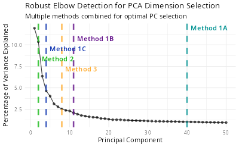

# Other Function Details in SigBridgeR

This document introduces several auxiliary functions of SigBridgeR.

## Add miscellaneous information to the Seurat object

SigBridgeR uses `AddMisc()` to record what data features or evidence the various screening algorithms are based on during execution.

-   `AddMisc()` : Add miscellaneous information to the Seurat object. Support for adding multiple attributes to the `SeuratObject@misc` slot simultaneously.

```{r,add_misc_example,eval=FALSE}
# basic usage
seurat_obj <- AddMisc(seurat_obj, "QC_stats" = qc_df)

# Auto-incrementing example when `cover` set to FALSE
seurat_obj <- AddMisc(seurat_obj, markers = markers1)
seurat_obj <- AddMisc(seurat_obj, markers = markers2, cover=FALSE)

# Add multiple attributes to the `SeuratObject@misc` slot simultaneously
seurat_obj <- AddMisc(seurat_obj, markers1 = markers1, markers2 = markers2)

# Add multiple attributes (stored as a list element) to the `SeuratObject@misc`
seurat_obj <- AddMisc(seurat_obj, list(attr1 = "value1", attr2 = "value2"))
```


## Load reference data

### Parameters

- `data_type`: The type of data to load. Can be either "continuous", "survival" or "binary", case-insensitive.
- `path`: The path to the data directory. 
- `cache`: Whether to cache the data. Defaults to `TRUE`.
- `timeout`: The maximum timeout time when downloading data.

When loading the example data, the single-cell RNA expression matrix, the bulk RNA expression matrix, and the clinical phenotype data are loaded all at once. These data are combined into a list and returned.

```{r,load_ref_data_example,eval=FALSE}
mydata <- LoadRefData(
    data_type = c("survival"),
    path = tempdir(),
    cache = TRUE,
    timeout = 60
)

# * mat_exam (matrix_example)
mydata[[1]][1:6,1:6]
#          SMC01.T_AAACCTGCATACGCCG SMC01.T_AAACCTGGTCGCATAT SMC01.T_AAACCTGTCCCTTGCA SMC01.T_AAACGGGAGGGAAACA SMC01.T_AAACGGGGTATAGGTA SMC01.T_AAAGATGAGGCCGAAT
# A1BG                            0                        0                        0                        0                        0                        0
# A1BG.AS1                        0                        0                        0                        0                        0                        0
# A1CF                            0                        2                        0                        0                        3                        0
# A2M                             0                        0                        0                        0                        0                        0
# A2M.AS1                         0                        0                        0                        0                        0                        0
# A2ML1                           0                        0                        0                        0                        0                        0

# * bulk_survival
mydata[[2]][1:6,1:6]
#         TCGA-69-7978 TCGA-62-8399 TCGA-78-7539 TCGA-73-4658 TCGA-44-6775 TCGA-44-2655
# HIF3A         4.2598      11.6239       9.1362       5.0288       4.0573       5.5335
# RTN4RL2       8.2023       5.5819       3.5365       7.4156       7.7107       5.3257
# HMGCLL1       2.7476       5.8513       3.8334       3.6447       2.9188       4.8820
# LRRTM1        0.0000       0.4628       4.7506       6.8005       7.7819       2.2882
# GRIN1         6.6074       5.4257       4.9563       7.3510       3.5361       3.3311
# LRRTM3        1.7458       2.0092       0.0000       1.4468       0.0000       0.0000

# * pheno_survival
mydata[[3]] |> head()
#               time status
# TCGA-69-7978  4.40      0
# TCGA-62-8399 88.57      0
# TCGA-78-7539 25.99      0
# TCGA-73-4658 52.56      1
# TCGA-44-6775 23.16      0
# TCGA-44-2655 43.50      0
```

We recommend using the `zeallot` package's `%<-%` function to assign values and rename them simultaneously.

```{r,load_ref_data_example_2,eval=FALSE}
library(zeallot)

c(mat_exam, bulk, pheno) %<-%  LoadRefData(
    data_type = c("survival"),
    path = tempdir(),
    cache = TRUE,
    timeout = 60
)
```

## Setting up Python Environment

Some screening methods (e.g. [Section 3.5 DEGAS](#35-option-e-degas-screening)) are built using Python and require an execution environment. Here is a function to help you set up a Python environment. Both Windows and Unix-like systems are supported.

```{r,setup_python_env_example,eval=FALSE}
# * This is an example of setting up a Python environment using conda
SetupPyEnv(
    env_type = "conda",
    env_name = "test-condaenv",
    method = c("reticulate", "system","environment"), # choose one of them, default is "reticulate"
    env_file = NULL # path to environment.yml file, used when method = "environment"
    python_version = NULL,
    packages = c(
        "pandas" = "1.3",
        "numpy" = "any"
    ),
    recreate = FALSE, # whether to remove the existing environment and recreate it
    use_conda_forge = TRUE,
    verbose = TRUE
) 

reticualte::use_condaenv("test-condaenv")
```

```{r,setup_python_env_example_2,eval=FALSE}
# * Or use virtualenv via reticulate
SetupPyEnv(
    env_type = "venv", 
    env_name = "test-venv", 
    python_version = "3.9.15",
    packages = c("tensorflow" = "2.4.1", "protobuf" = "3.20.3"),
    python_path = NULL,
    recreate = FALSE,
    verbose = TRUE
)

reticulate::use_virtualenv("test-venv")
```

You can use `ListPyEnv()` to list all the Python environments you have set up. Both conda and virtual environments are supported.

```{r,list_py_env_example,eval=FALSE}
# * Unix-like systems
ListPyEnv()
#                 name                                                  python  type
# 1               base                        /home/user/miniconda3/bin/python conda
# 2      test-condaenv     /home/user/miniconda3/envs/test-condaenv/bin/python conda
# 3          test-venv         /home/user/miniconda3/envs/test-venv/bin/python  venv
```

Show the conda environments only:

```{r,list_py_env_example_2,eval=FALSE}
# * Unix-like systems
ListPyEnv(env_type = "conda")
#                 name                                                  python  type
# 1               base                        /home/user/miniconda3/bin/python conda
# 2      test-condaenv     /home/user/miniconda3/envs/test-condaenv/bin/python conda
```

If the virtual environment isn't installed in the default location, you can specify the location of the virtual environment with the `venv_locations` parameter.

```{r,list_py_env_example_3,eval=FALSE}
ListPyEnv(env_type = "venv", venv_locations ="~/here_is_a_dir/.virtualenvs")
```

## Finding the Optimal Number of Principle Components 

Usually the number if principle components (PCs) is manually set to 10 or 20 according to the elbow plot. However, it is not always the case that the PCs with the highest variance are the most informative. Here is a function to help you find the optimal number of PCs.

```{r,find_optimal_pc_example,eval=FALSE}
ndims <- FindRobustElbow(
  obj = seurat,
  verbose = TRUE,
  ndims = 50 
)
# ── Method Results 
# ℹ Method 1A (Cumulative Variance > 90%): 1:40
# ℹ Method 1B (Variance > Mean): 1:11
# ℹ Method 1C (Variance > 2*SD): 1:4
# ℹ Method 2 (Second Derivative): 1:2
# ℹ Method 3 (Distance-based): 1:8
# ✔ Final Recommended Dimensions:  1:35

# ── Summary 
# ℹ Cumulative variance at 35 PCs: 84.8%
# ℹ Variance explained by PC35: 1.09%

print(ndims)
# 35
```

This function will draw an elbow plot with each method and the recommended number of PCs. You can also use the `ndims` parameter to specify the maximum number of PCs to be tested. The default value is `50`.

```{r,example_data_elbow_plot,eval=FALSE}
knitr::include_graphics("vignettes/example_figures/elbow.png")
```

[{fig-align="center" width="600"}]((https://github.com/WangLabCSU/SigBridgeR/blob/main/vignettes/example_figures/elbow.png))

## Setting and Retriving Package Options

Currently, 5 package options are provided:

- `verbose`: Whether to print the progress of the function. Default is `TRUE`.
- `seed`: The random seed used in the function. Default is `123L`.
- `timeout`: The maximum timeout time when downloading data. Default is `180L`.
- `parallel`: Whether to use parallel computing when finding optimal parameters. Default is `FALSE`
- `workers`: The number of workers to use when using parallel computing. Default is `4L`.

These options can be modified using either the `setFuncOption` or `Options` function (the former is recommended).

```{r,package_options_example,eval=FALSE}
setFuncOption(seed = 321L)

options(SigBridgeR.seed = 321L)
```

`setFuncOption` automatically detects the prefix, so parameters with a package name prefix are also compatible.

```{r,package_options_example_2,eval=FALSE}
setFuncOption(SigBridgeR.seed = 321L)
```

`getFuncOption` is used to retrieve the global parameters of SigBridgeR.

```{r,package_options_example_3,eval=FALSE}
getFuncOption("seed")
# 321

# * Auto-detect prefix 
getFuncOption("SigBridgeR.seed")
# 321
```