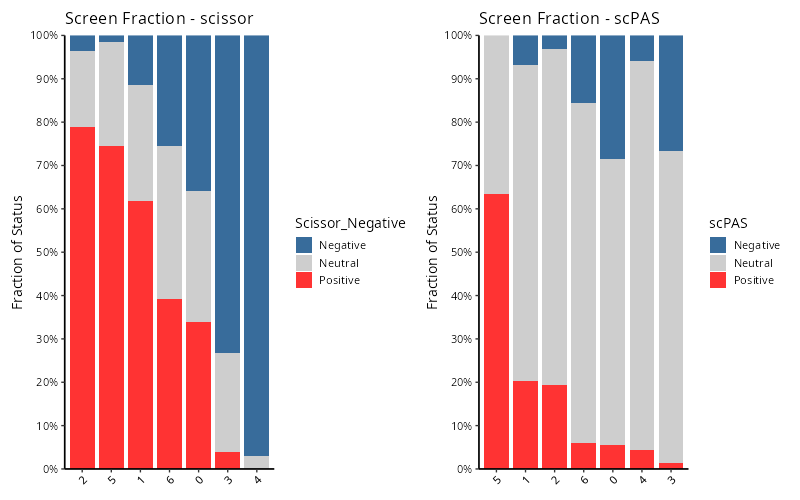
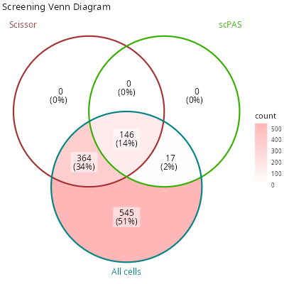
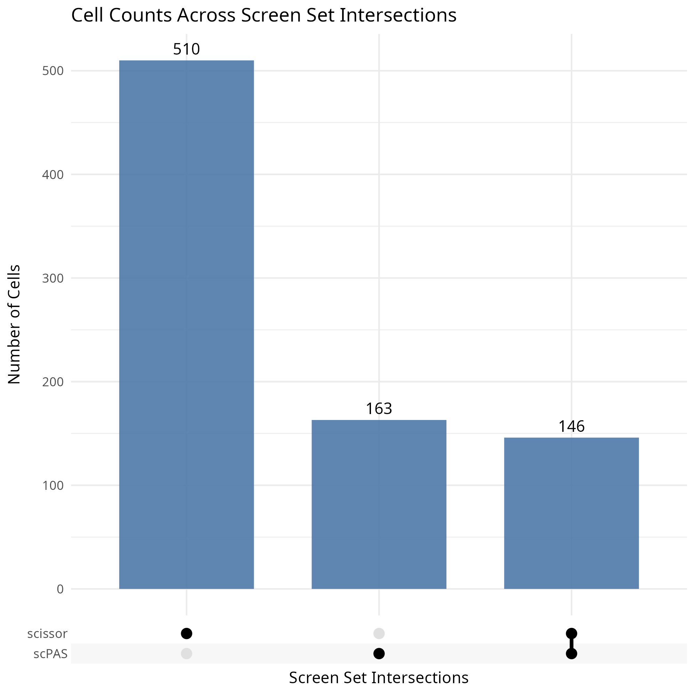
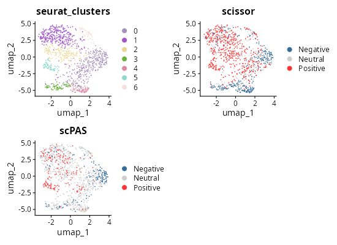

# Quick Start Guide for SigBridgeR

    if (!requireNamespace("remotes")) {
      install.packages("remotes")
    }
    remotes::install_github("WangLabCSU/SigBridgeR")

    # # Or install from r-universe:
    # install.packages("SigBridgeR", repos = "https://wanglabcsu.r-universe.dev")

    library(SigBridgeR)
    library(Seurat)

We will start with a simple example.

    if (requireNamespace("here", quietly = TRUE)) {
      setwd(here::here())
      knitr::opts_knit$set(root.dir = here::here())
    }

    library(zeallot) # %<-%
    c(mat_exam, bulk_bi, pheno_bi) %<-% LoadRefData(data_type = "binary")

`mat_exam` is a single-cell RNA expression matrix, `bulk_bi` is a bulk
tissue RNA expression matrix, and `pheno_bi` is the phenotypic data
associated with `bulk_bi`. When using a binary or continuous phenotype,
the reference phenotype data is a named vector.

    head(pheno_bi)
    # TCGA-CA-5256-01 TCGA-AZ-6599-01 TCGA-AA-3655-01 TCGA-A6-6137-01 TCGA-CK-4952-01 TCGA-A6-5657-01
    #               1               1               1               1               1               1

By the way, when usinng a survival phenotype, the reference data is a
data.frame.

    pheno_sur <- LoadRefData(data_type = "survival")[[3]]
    head(pheno_sur)
    #               time status
    # TCGA-69-7978  4.40      0
    # TCGA-62-8399 88.57      0
    # TCGA-78-7539 25.99      0
    # TCGA-73-4658 52.56      1
    # TCGA-44-6775 23.16      0
    # TCGA-44-2655 43.50      0

The single-cell RNA expression matrix needs to be processed into a
Seurat object. We set scale\_features to all genes in order to maximize
the flexibility of downstream analyses and capture a broader range of
biological signals, so as to avoid insignificant results caused by too
small a dataset.

    seurat_obj <- SCPreProcess(
      mat_exam,
      quality_control.pattern = "^MT-",
      scale_features = rownames(mat_exam),
      dims = 1:20
    )

Then we can use these data to screen out phenotype-assoicated cells.
Let’s start by trying **Scissor**.

    scissor_res <- Screen(
      bulk_bi,
      seurat_obj,
      pheno_bi,
      phenotype_class = "binary",
      screen_method = "Scissor",
      alpha = 0.05
    )

Other screening methods are also available.

    scpas_res <- Screen(
      bulk_bi,
      seurat_obj,
      pheno_bi,
      phenotype_class = "binary",
      screen_method = "scPAS",
      alpha = 0.05
    )

Since the screening is performed on the same data, we merge them.

    merged_seurat <- MergeResult(
      scissor_res,
      scpas_res
    )

Finally, we visualize the screening results.

-   stacked bar plot:

<!-- -->

    fraction = ScreenFractionPlot(
      merged_seurat,
      group_by = "seurat_clusters",
      screen_type = c("scissor", "scPAS")
    )

    # names(fraction)
    # [1] "stats"         "plot"          "combined_plot"

    knitr::include_graphics("vignettes/example_figures/fraction_q.png")

-   Venn diagram:

<!-- -->

    c(scissor_pos, scpas_pos) %<-%
      purrr::map(
        c("scissor", "scPAS"),
        ~ colnames(merged_seurat)[
          which(merged_seurat[[.x]] == "Positive")
        ]
      )

    all_cells <- colnames(seurat_obj)

    pos_venn = list(
      scissor = scissor_pos,
      scpas = scpas_pos,
      all_cells = all_cells
    )

    set.seed(123)

    venn_plot = ggVennDiagram::ggVennDiagram(
      x = pos_venn,
      # * the labels of each group to be shown on the diagram
      category.names = c(
        "Scissor",
        "scPAS",
        "All cells"
      ),
      # * the colors of each group
      set_color = c(
        "#a33333ff",
        "#37ae00ff",
        "#008383ff"
      ),
      label_geom = c("text")
    ) +
      ggplot2::scale_fill_gradient(low = "white", high = "#ffb6b6ff") +
      ggplot2::ggtitle("Screening Venn Diagram")

    knitr::include_graphics("vignettes/example_figures/venn_q.png")

)

-   Set plot:

<!-- -->

    upset <- ScreenUpset(
      merged_seurat,
      screen_type = c("scissor", "scPAS")
    )

    knitr::include_graphics("vignettes/example_figures/upset_q.png")

)

-   2D UMAP:

<!-- -->

    library(patchwork)
    library(randomcoloR)

    c(
      scissor_umap,
      scpas_umap
    ) %<-%
      purrr::map(
        c("scissor", "scPAS"),
        ~ Seurat::DimPlot(
          merged_seurat,
          group.by = .x,
          pt.size = 0.1,
          reduction = "umap",
          cols = c(
            "Neutral" = "#CECECE",
            "Positive" = "#ff3333",
            "Negative" = "#386c9b"
          )
        ) +
          ggplot2::ggtitle(.x)
      )

    set.seed(123)
    cols = randomcoloR::distinctColorPalette(
      length(unique(merged_seurat$seurat_clusters)),
      runTsne = TRUE
    )

    cluster_umap <- Seurat::DimPlot(
      merged_seurat,
      group.by = "seurat_clusters",
      pt.size = 0.1,
      reduction = "umap",
      cols = cols
    ) +
      ggplot2::ggtitle("seurat_clusters")

    # * Show
    umaps = cluster_umap +
      scissor_umap +
      scpas_umap +
      plot_layout(ncol = 2)

    umaps

    knitr::include_graphics("vignettes/example_figures/umaps_q.png")

Session information:
